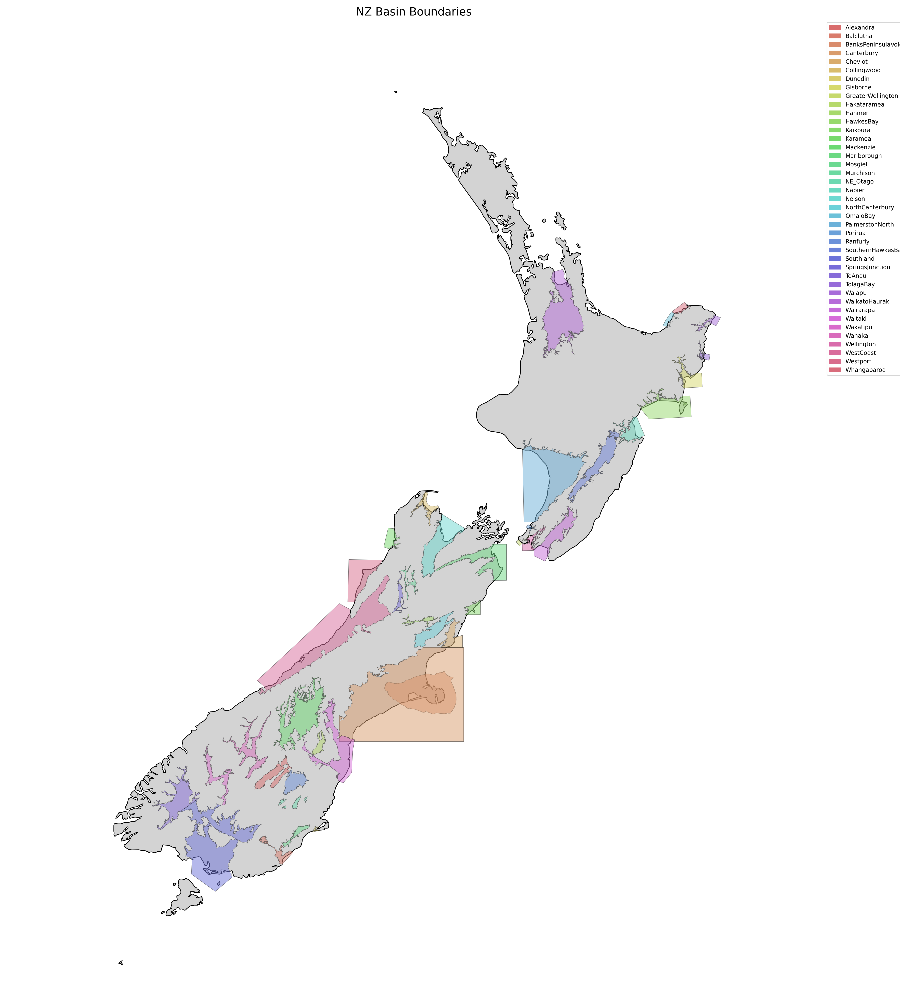

# Basins in the New Zealand Velocity Model (version 2.08)

This page provides an overview of sedimentary basin models integrated into the New Zealand Velocity Model.

<!-- Referenced map image -->

##  Bay of Plenty Region
- [OmaioBay v25p5](basins/OmaioBay.md)
- [Whangaparoa v23p4](basins/Whangaparoa.md)

##  Canterbury Region
- [BanksPeninsulaVolcanics v19p1](basins/BanksPeninsulaVolcanics.md)
- [Canterbury v19p1](basins/Canterbury.md)
- [Cheviot v19p1](basins/Cheviot.md)
- [Hakataramea v20p8](basins/Hakataramea.md)
- [Hanmer v25p3](basins/Hanmer.md)
- [Kaikoura v25p5](basins/Kaikoura.md)
- [Mackenzie v20p6](basins/Mackenzie.md)
- [NorthCanterbury v19p1](basins/NorthCanterbury.md)
- [Waitaki v20p8](basins/Waitaki.md)

##  Gisborne Region
- [Gisborne v21p11](basins/Gisborne.md)
- [TolagaBay v25p5](basins/TolagaBay.md)
- [Waiapu v25p5](basins/Waiapu.md)

##  Hawke's Bay Region
- [HawkesBay v21p7](basins/HawkesBay.md)
- [Napier v21p7](basins/Napier.md)

##  Manawatū-Whanganui Region
- [PalmerstonNorth v25p5](basins/PalmerstonNorth.md)
- [SouthernHawkesBay v21p12](basins/SouthernHawkesBay.md)

##  Marlborough Region
- [Marlborough v19p1](basins/Marlborough.md)

##  Otago Region
- [Alexandra v20p7](basins/Alexandra.md)
- [Balclutha v20p7](basins/Balclutha.md)
- [Dunedin v20p7](basins/Dunedin.md)
- [Mosgiel v20p7](basins/Mosgiel.md)
- [NE_Otago v20p7](basins/NE_Otago.md)
- [Ranfurly v20p7](basins/Ranfurly.md)
- [Wakatipu v20p7](basins/Wakatipu.md)
- [Wanaka v20p6](basins/Wanaka.md)

##  Southland Region
- [Southland v25p5](basins/Southland.md)
- [TeAnau v25p5](basins/TeAnau.md)

##  Tasman Region
- [Collingwood v20p11](basins/Collingwood.md)
- [Murchison v20p7](basins/Murchison.md)
- [Nelson v25p5](basins/Nelson.md)

##  Waikato Region
- [WaikatoHauraki v19p7](basins/WaikatoHauraki.md)

##  Wellington Region
- [GreaterWellington v21p7](basins/GreaterWellington.md)
- [Porirua v21p7](basins/Porirua.md)
- [Wairarapa v21p12](basins/Wairarapa.md)
- [Wellington v25p5](basins/Wellington.md)

##  West Coast Region
- [Karamea v20p11](basins/Karamea.md)
- [SpringsJunction v20p11](basins/SpringsJunction.md)
- [WestCoast v25p5](basins/WestCoast.md)
- [Westport v25p5](basins/Westport.md)

## Version Information

The version number in each basin name (e.g., v19p1) follows the format:
- Year (e.g., 19 = 2019)
- Point release (e.g., p1 = January)

Newer versions typically include refinements to basin geometry or velocity structure.
