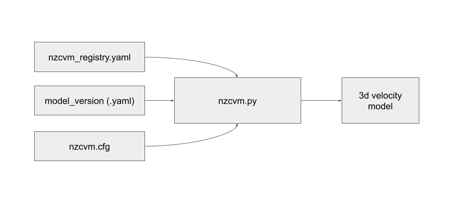

# Generating 3D Models

## Overview



The `generate_3d_model.py` script creates 3D velocity models by combining various geophysical datasets according to a specified model version configuration.

## Input Requirements

The script requires one primary input file:

1. **`nzcvm.cfg`**: Configuration file defining the 3D model parameters (grid, location, output settings)

The script automatically uses:
- **Model version YAML file**: Defines which data components to combine (see [Model Versions](Model-Versions.md))
- **`nzcvm_registry.yaml`**: Data registry from the `nzcvm_data` repository

## Basic Usage

```bash
python scripts/generate_3d_model.py /path/to/config/nzcvm.cfg
```

### Required Arguments
- **Configuration File**: Path to the `nzcvm.cfg` file

### Optional Arguments
- **--out-dir**: Output directory (overrides `OUTPUT_DIR` in config)
- **--model-version**: Override model version from config file
- **--output-format**: Format (EMOD3D, CSV, HDF5)
- **--nzcvm-registry**: Custom registry file path
- **--nzcvm-data-root**: Override default data directory
- **--log-level**: Logging level (DEBUG, INFO, WARNING, ERROR)

## Configuration File (nzcvm.cfg)

The configuration file defines the 3D model grid and generation parameters:

```ini
CALL_TYPE=GENERATE_VELOCITY_MOD
MODEL_VERSION=2.03
ORIGIN_LAT=-43.4776
ORIGIN_LON=172.6870
ORIGIN_ROT=23.0
EXTENT_X=20
EXTENT_Y=20
EXTENT_ZMAX=45.0
EXTENT_ZMIN=0.0
EXTENT_Z_SPACING=0.2
EXTENT_LATLON_SPACING=0.2
MIN_VS=0.5
TOPO_TYPE=BULLDOZED
OUTPUT_DIR=/tmp
```

### Parameter Descriptions

#### Model Definition
- **CALL_TYPE**: Must be `GENERATE_VELOCITY_MOD`
- **MODEL_VERSION**: Version identifier (links to YAML file in `model_versions/`)

#### Grid Geometry
- **ORIGIN_LAT/LON**: Grid origin coordinates
- **ORIGIN_ROT**: Grid rotation (degrees clockwise from north)
- **EXTENT_X/Y**: Grid size in kilometers
- **EXTENT_ZMIN/ZMAX**: Depth range in kilometers
- **EXTENT_Z_SPACING**: Vertical grid spacing in kilometers
- **EXTENT_LATLON_SPACING**: Horizontal grid spacing in degrees

#### Model Parameters
- **MIN_VS**: Minimum shear wave velocity (m/s)
- **TOPO_TYPE**: Topography handling method
- **OUTPUT_DIR**: Output file location

### Topography Types


- **TRUE**: Follows actual surface topography
- **BULLDOZED**: Flat surface at sea level
- **SQUASHED**: Compressed topography
- **SQUASHED_TAPERED**: Compressed with edge tapering

### Web Configuration Tool

Generate configuration files at: https://quakecoresoft.canterbury.ac.nz/nzcvm_config/


## Example Usage Scenarios

### 1. Basic Canterbury Region Model
```bash
# Create config file for Canterbury
cat > canterbury.cfg << EOF
CALL_TYPE=GENERATE_VELOCITY_MOD
MODEL_VERSION=2.03
ORIGIN_LAT=-43.4776
ORIGIN_LON=172.6870
ORIGIN_ROT=23.0
EXTENT_X=20
EXTENT_Y=20
EXTENT_ZMAX=45.0
EXTENT_ZMIN=0.0
EXTENT_Z_SPACING=0.2
EXTENT_LATLON_SPACING=0.2
MIN_VS=0.5
TOPO_TYPE=BULLDOZED
OUTPUT_DIR=/tmp/canterbury
EOF

# Generate model
python scripts/generate_3d_model.py canterbury.cfg
```

### 2. Wellington Model with CSV Output
```bash
python scripts/generate_3d_model.py wellington.cfg \
  --output-format CSV \
  --out-dir /path/to/wellington_output
```

### 3. Custom Model Version
```bash
python scripts/generate_3d_model.py config.cfg \
  --model-version custom_1.0 \
  --log-level DEBUG
```

## Output Files

The script generates files in the specified output directory:

### EMOD3D Format (Default)
- **`vp3dfile.p`**: P-wave velocity values
- **`vs3dfile.s`**: S-wave velocity values  
- **`rho3dfile.d`**: Density values
- **`in_basin_mask.b`**: Basin membership IDs

### Alternative Formats
- **CSV**: `velocity_model.csv` (with `--output-format CSV`)
- **HDF5**: `velocity_model.h5` (with `--output-format HDF5`)

For detailed format specifications, see [Output Formats](OutputFormats.md).

## Model Version Integration

The `MODEL_VERSION` parameter in your config file determines which components are used:

```ini
MODEL_VERSION=2.03  # Uses model_versions/2p03.yaml
```

This YAML file specifies:
- Which tomography model to use
- Which basins to include
- Surface handling methods
- Special processing options

For details on model versions, see [Model Versions](Model-Versions.md).

## Performance Considerations

### Grid Size Impact
- Smaller spacing = higher resolution but longer computation time
- Balance resolution needs with available resources

### Memory Requirements
- Large grids may require significant RAM
- Consider chunking for very large models

### Typical Processing Times
- Small regional model (10×10×20 km): Minutes
- Large regional model (100×100×50 km): Hours
- Full country model: Multiple hours to days

## Troubleshooting

### Common Issues
1. **Model version not found**: Check `model_versions/` folder for corresponding YAML file
2. **Data files missing**: Ensure `nzcvm_data` repository is properly linked
3. **Memory errors**: Reduce grid size or increase system memory
4. **Permission errors**: Check write permissions for output directory

### Debug Mode
```bash
python scripts/generate_3d_model.py config.cfg --log-level DEBUG
```

This provides detailed information about:
- Model version loading
- Data file access
- Grid generation progress
- Component integration

### Validation
Check output files:
```bash
# Verify file sizes are reasonable
ls -lh /path/to/output/

# For CSV output, check first few lines
head /path/to/output/velocity_model.csv
```

## Advanced Usage

### Custom Data Registry
```bash
python scripts/generate_3d_model.py config.cfg \
  --nzcvm-registry /path/to/custom_registry.yaml
```

### Multiple Output Formats
```bash
# Generate EMOD3D files (default)
python scripts/generate_3d_model.py config.cfg

# Also generate CSV version
python scripts/generate_3d_model.py config.cfg --output-format CSV

# Also generate HDF5 version  
python scripts/generate_3d_model.py config.cfg --output-format HDF5
```

## Integration with Other Tools

The generated 3D models can be used with:
- Ground motion simulation software (e.g., EMOD3D)
- Visualization tools
- Cross-section extraction (`extract_cross_section.py`)
- 1D profile generation (`generate_1d_profiles.py`)

For workflow examples, see the main [README](../README.md).
