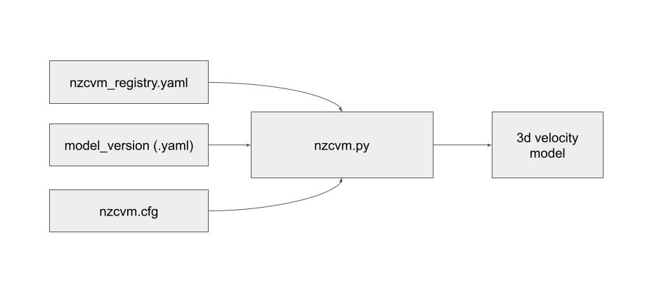
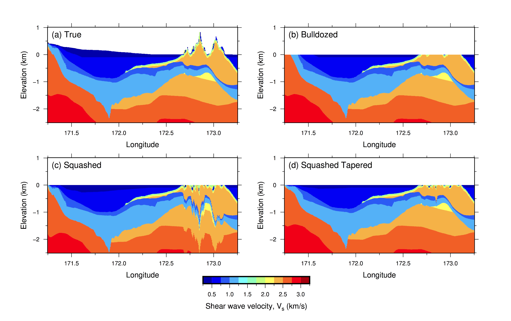
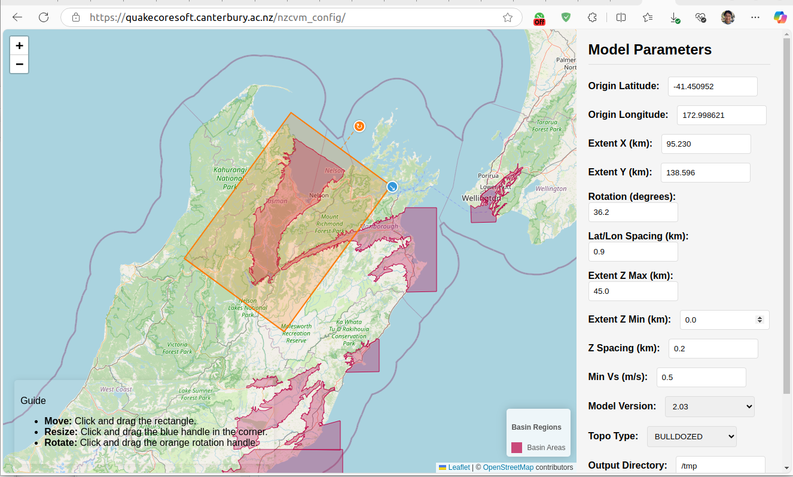

## Basic Usage

### Generating a Velocity Model



`nzcvm.py` needs three input files to generate a velocity model.

(1)  `nzcvm_registry.yaml` : A wide range of community data that is curated and registered in this YAML file. This is an interface layer between NZCVM code and the storage of data files. A default file is used unless user overrides.

(2)  A model version (`.yaml`) : This YAML file defines different configurations of the velocity model. This allows users to select different combinations of tomography models, basins, and other parameters. Model versions 2.03 and 2.07 are pre-configured and the corresponding YAML files, `2p03.yaml` and `2p07.yaml` are located in `cvm/model_versions`. Users are allowed to create a custom model version and place the `.yaml` file in the folder. 

(3) `nzcvm.cfg`: The details of the velocity model to generate. In most scenarios, this is the only file users may need to provide to `nzvm.py`


The simplest command will look like:

```bash
python cvm/scripts/nzcvm.py generate-velocity-model /path/to/config/nzcvm.cfg
```


#### Required Arguments

- **Configuration File**: Path to the `nzcvm.cfg` file that defines the model parameters


#### Optional Arguments

- **--out-dir**: Directory where the output files will be saved. If not supplied, `OUTPUT_DIR` from nzcvm.cfg will be used
- **--nzcvm-registry**: Path to the model registry file. If not specified, the default `nzcvm_registry.yaml` is used
- **--model-version**: Override the model version specified in the configuration file
- **--output-format**: Specify the output format (EMOD3D, CSV, or HDF5)
- **--data-root**: Override the default DATA_ROOT directory. If not specified, the default `cvm/data` is used
- **--smoothing**: Enable smoothing at model boundaries (not currently implemented)
- **--log-level**: Set the logging level (DEBUG, INFO, WARNING, ERROR)


### Example Usage Scenarios

1. Create a custom nzcvm.cfg configuration file:

```ini
CALL_TYPE=GENERATE_VELOCITY_MOD
MODEL_VERSION=2.03  
ORIGIN_LAT=-43.4776
ORIGIN_LON=172.6870
ORIGIN_ROT=23.0
EXTENT_X=20
EXTENT_Y=20
EXTENT_ZMAX=45.0
EXTENT_ZMIN=0.0
EXTENT_Z_SPACING=0.2
EXTENT_LATLON_SPACING=0.2
MIN_VS=0.5
TOPO_TYPE=BULLDOZED
OUTPUT_DIR=/tmp
```

- **CALL_TYPE**: Specifies the type of operation to perform. In this case, it is set to `GENERATE_VELOCITY_MOD` to generate a velocity model.
- **MODEL_VERSION**: Indicates the version of the velocity model. Will use 2p03.yaml from `model_version` folder
- **ORIGIN_LAT**: Latitude of the origin point for the model grid.
- **ORIGIN_LON**: Longitude of the origin point for the model grid.
- **ORIGIN_ROT**: Rotation angle of the model grid in degrees.
- **EXTENT_X**: Extent of the model grid in the X direction (in kilometers).
- **EXTENT_Y**: Extent of the model grid in the Y direction (in kilometers).
- **EXTENT_ZMAX**: Maximum depth of the model grid (in kilometers).
- **EXTENT_ZMIN**: Minimum depth of the model grid (in kilometers).
- **EXTENT_Z_SPACING**: Spacing between grid points in the Z direction (in kilometers).
- **EXTENT_LATLON_SPACING**: Spacing between grid points in the latitude and longitude directions (in degrees).
- **MIN_VS**: Minimum shear wave velocity (in meter per second).
- **TOPO_TYPE**: Type of topography to use. Possible values are `BULLDOZED`, `SQUASHED`, `SQUASHED_TAPERED` and `TRUE`. 
- **OUTPUT_DIR**: Directory where the generated velocity model files will be saved.




*Figure 1: Different types of topography used in the NZCVM, including BULLDOZED, SQUASHED, SQUASHED_TAPERED, and TRUE.*


An nzcvm.cfg file can be configured and downloaded via a web-based interface at https://quakecoresoft.canterbury.ac.nz/nzcvm_config/




*Figure 2: Web interface for nzcvm.cfg generation and download*


2. Run the script with the custom configuration:

```bash
python cvm/scripts/nzcvm.py generate-velocity-model /path/to/custom/nzcvm.cfg --out-dir /path/to/output
```


## Output Files

After successful execution, the output files will be located in the specified output directory. The main output files include:

- **EMOD3D Files**: Binary files containing velocity and density values
  - `vp3dfile.p`: P-wave velocity values
  - `vs3dfile.s`: S-wave velocity values
  - `rho3dfile.d`: Density values
  - `in_basin_mask.b`: Basin membership (ID of the basin the grid point belongs to; -1 indicates not inside any basin)

CSV and HDF5 formats are also supported with `--output-format CSV` or `--output-format HDF5` option.

For more details on the output formats, see the [Output Formats](OutputFormats.md) page.


## Detailed Configuration Guide

### Model Version System

The NZCVM uses a model version system to define different configurations of the velocity model. This allows users to select different combinations of tomography models, basins, and other parameters.


#### Relationship Between nzcvm.cfg and Model Version Files


From the `nzcvm.cfg` above, notice this line.
```ini
MODEL_VERSION=2.03  
```

When you specify a `MODEL_VERSION` in your nzcvm.cfg file (e.g., `MODEL_VERSION=2.03`), the system looks for a corresponding YAML file in the `model_version` folder. 
The naming convention replaces dots with 'p', so for `MODEL_VERSION=2.03`, the system looks for `2p03.yaml`.

You can also override the model version at runtime using the `--model-version` parameter:

```bash
python cvm/scripts/nzcvm.py generate-velocity-model /path/to/nzcvm.cfg --out-dir /path/to/output --model-version 2.07
```


#### Explaining 2p03.yaml

The `2p03.yaml` file defines the components and parameters for model version 2.03. Here's a detailed explanation of its contents:

```yaml
GTL: true
surfaces:
  - path: global/surface/NZ_DEM_HD.in
    submodel: ep_tomography_submod_v2010

tomography: 2010_NZ_OFFSHORE
basin_edge_smoothing: true
basins:
  - Canterbury_v19p1
  - NorthCanterbury_v19p1
  - BanksPeninsulaVolcanics_v19p1
  - Kaikoura_v19p1
  - Cheviot_v19p1
  - Hanmer_v19p1
  - Marlborough_v19p1
  - Nelson_v19p1
  - Wellington_v19p6
  - WaikatoHauraki_v19p7
```


**Explanation of key components:**

1. **GTL** (Geotechnical Layer): When set to `true`, enables the use of a geotechnical layer that models near-surface velocity structures based on Vs30 values.

2. **surfaces**: Defines the global surfaces used in the model. Each surface has:
   - **path**: The location of the surface data file
   - **submodel**: The velocity model submodule used for assigning velocity values below this surface
   
   In this example, `NZ_DEM_HD.in` is a high-definition digital elevation model for New Zealand, and `ep_tomography_submod_v2010` is the submodel that computes velocities using the 2010 tomography model.

3. **tomography**: Specifies which tomography model to use. `2010_NZ_OFFSHORE` is an extension of the 2010 Eberhart-Phillips tomography model that includes offshore regions.

4. **basin_edge_smoothing**: When set to `true`, applies smoothing at basin edges to avoid sharp transitions between basin and non-basin regions.

5. **basins**: Lists all the basin models incorporated into this version. Each basin is defined in the `nzcvm_registry.yaml` file with its own surfaces, boundaries, and submodels.


### Creating Custom Model Versions

You can create your own model version by placing a new YAML file in the `model_version` folder. Follow the naming convention of using 'p' in place of dots (e.g., `custom_1p0.yaml` for version 1.0).

Steps to create a custom model version:

1. Create a new YAML file in the `model_version` folder (e.g., `custom_1p0.yaml`)
2. Define the required components (GTL, surfaces, tomography, and basins)
3. Run the model with your custom version by either:
   - Setting `MODEL_VERSION=custom_1.0` in your nzcvm.cfg file
   - Using the `--model-version custom_1.0` argument when running nzcvm.py

Example of a minimal custom model version:

```yaml
GTL: true
surfaces:
  - path: global/surface/NZ_DEM_HD.in
    submodel: ep_tomography_submod_v2020

tomography: 2020_NZ_OFFSHORE
basin_edge_smoothing: true
basins:
  - Wellington_v19p6
  - GreaterWellington_v19p6
```

This custom version uses the 2020 tomography model and only includes the Wellington and Greater Wellington basins.


## Running the Model

To generate a velocity model using a specific configuration:

1. Prepare your nzcvm.cfg file with the desired parameters, including MODEL_VERSION
2. Run the nzcvm.py script with the necessary arguments


### Complete Example: Wellington Model with Version 2.07

1. Create or use an existing nzcvm.cfg file:

```ini
CALL_TYPE=GENERATE_VELOCITY_MOD
MODEL_VERSION=2.07
ORIGIN_LAT=-41.2865
ORIGIN_LON=174.7762
ORIGIN_ROT=0.0
EXTENT_X=50
EXTENT_Y=50
EXTENT_ZMAX=50.0
EXTENT_ZMIN=0.0
EXTENT_Z_SPACING=0.1
EXTENT_LATLON_SPACING=0.1
MIN_VS=0.5
TOPO_TYPE=BULLDOZED
OUTPUT_DIR=/path/to/output
```

2. Run the script:

```bash
python cvm/scripts/nzcvm.py generate-velocity-model /path/to/nzcvm.cfg --out-dir /path/to/output
```

3. The script will:
   - Read the configuration from nzcvm.cfg
   - Load the model version 2.07 from 2p07.yaml
   - Set up the model grid based on the specified origin and extent
   - Apply the tomography model specified in 2p07.yaml
   - Incorporate the basins listed in 2p07.yaml
   - Generate the velocity model files in the output directory

4. Check the output directory for the generated files:
   - EMOD3D binary files (`vp3dfile.p`, `vs3dfile.s`, `rho3dfile.d`, `in_basin_mask.b`)
   - CSV file (if requested): `velocity_model.csv`
   - HDF5 file (if requested): `velocity_model.h5`
