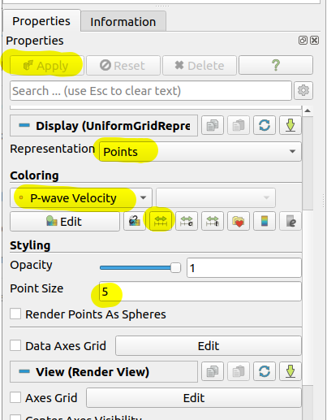
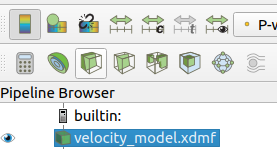
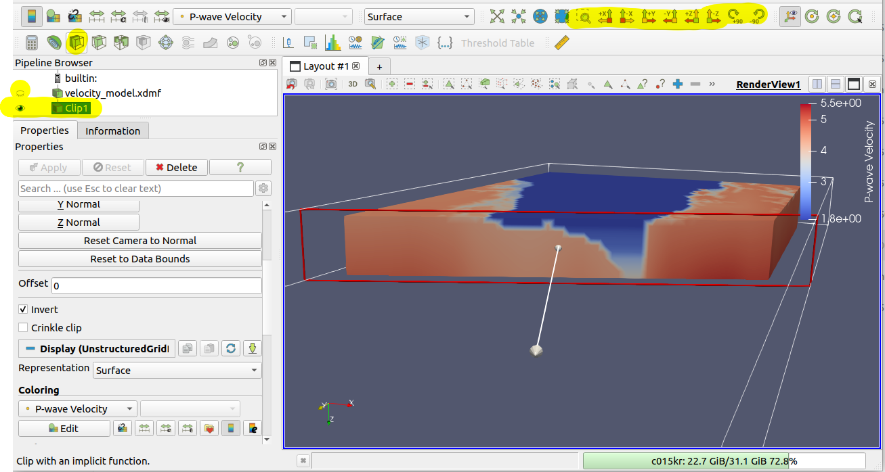

# Output Formats in NZCVM

This page provides detailed information about the output formats generated by the NZCVM, including the EMOD3D format and CSV files.

## EMOD3D Format

The EMOD3D format is the primary output format of the NZCVM. It is used by the EMOD3D finite difference wave propagation code for earthquake ground motion simulations.

### File Structure

The EMOD3D output consists of three binary files: 
- `vp3dfile.p`: P-wave velocity values
- `vs3dfile.s`: S-wave velocity values
- `rho3dfile.d`: Density values
- `in_basin_mask.b`: Basin membership (ie. ID of the basin the grid point belongs to. -1 indicates not inside any basin)

Each file contains a 3D grid of values in a binary format, which can be read using the following Python code.

### Reading EMOD3D Files

Here's an example of how to read EMOD3D files in Python:

```python
import numpy as np
import struct
import sys

def read_emod3d_file(filename, nx, ny, nz):
    """
    Read an EMOD3D binary file.
    
    Parameters:
    filename (str): Path to the EMOD3D file
    nx, ny, nz (int): Grid dimensions
    
    Returns:
    numpy.ndarray: 3D array of values
    """
    endianness = sys.byteorder
    endian_format = "<" if endianness == "little" else ">"
    
    with open(filename, 'rb') as f:
        file_content = f.read()
        num_elements = len(file_content) // 4
        data = np.array(
            struct.unpack(f"{endian_format}{num_elements}f", file_content),
            dtype=np.float32
        )
    
    # Reshape to 3D grid (Fortran order)
    data = data.reshape((nx, ny, nz), order='F')
    
    return data

# Read velocity and density files
vp = read_emod3d_file('vp3dfile.p', nx, ny, nz)
vs = read_emod3d_file('vs3dfile.s', nx, ny, nz)
rho = read_emod3d_file('rho3dfile.d', nx, ny, nz)
inbasin = read_emod3d_file('in_basin_mask.b', nx, ny, nz)
```

## CSV Format

In addition to the EMOD3D format, the NZCVM can also output velocity models in CSV format for easier inspection and analysis.

### Format Specification

The CSV output contains one row per grid point, with the following columns:
- `y`, `x`, `z`: Grid coordinates (in kilometers)
- `lon`, `lat`, `depth`: Geographic coordinates. `depth` is negative for depths below the surface (in meters)
- `vp`: P-wave velocity (in km/s)
- `vs`: S-wave velocity (in km/s)
- `rho`: Density (in g/cm³)

### Example

```
y,x,z,lat,lon,depth,vp,vs,rho,inbasin
0,0,0,-40.7843951540506,173.21166935182586,-125.0,1.8,0.58,1.81,-1
0,0,1,-40.7843951540506,173.21166935182586,-375.0,1.8,0.83,1.81,-1
0,0,2,-40.7843951540506,173.21166935182586,-625.0,2.03,1.0,1.92,-1
0,0,3,-40.7843951540506,173.21166935182586,-875.0,2.14,1.05,1.97,-1
0,0,4,-40.7843951540506,173.21166935182586,-1125.0,2.2,1.1,1.99,-1
0,0,5,-40.7843951540506,173.21166935182586,-1375.0,2.4,1.15,2.06,-1
...
```

### Reading CSV Files

CSV files can be easily read using a spreadsheet application like MS Excel. Here's an example in Python that shows how to efficiently access velocity values using pandas indexing:

```python
import pandas as pd

# Read CSV file
df = pd.read_csv('velocity_model.csv')

# Set x, y, z as multi-index for efficient lookup
df.set_index(['x', 'y', 'z'], inplace=True)

# Access values directly using index lookup (much faster for large datasets)
X, Y, Z = 10.0, 15.0, 2.0
try:
    # One-liner to get values at a specific point
    vp = df.loc[(X, Y, Z), 'vp']
    vs = df.loc[(X, Y, Z), 'vs']
    rho = df.loc[(X, Y, Z), 'rho']
    print(f"At (x={X}, y={Y}, z={Z}): Vp={vp} km/s, Vs={vs} km/s, density={rho} g/cm³")
except KeyError:
    print(f"Point (x={X}, y={Y}, z={Z}) not found in the model")

```

## HDF5 Format

HDF5 (Hierarchical Data Format version 5) is an efficient binary format for storing large scientific datasets with metadata. This format offers several advantages:

- **Single consolidated file**: All velocity model data is stored in one file
- **Efficient storage with compression**: Reduces file size compared to uncompressed formats
- **Self-describing format with embedded metadata**: Units, model version, and other metadata stored with the data
- **High-performance I/O**: Supports fast reading of specific data regions
- **Cross-platform compatibility**: Works across different operating systems and environments
- **Supports parallel I/O**: Beneficial for high-performance computing applications

### Using HDF5 Format

To generate a velocity model in HDF5 format:

```bash
python scripts/nzcvm.py generate-velocity-model /path/to/nzcvm.cfg --output-format HDF5
```

### HDF5 File Structure

The HDF5 output consists of a single file:
- Location: `<output_dir>/velocity_model.h5`

The file structure is organized as follows:

- **Root attributes**:
  - `total_y_slices`: Total number of latitude slices in the model
  - `format_version`: Version of the HDF5 format specification
  - `complete`: Boolean flag indicating if the model is complete
  - `model_version`: Version of the velocity model being used

- **`/mesh` group**:
  - `x`: Array of X coordinates (km)
  - `y`: Array of Y coordinates (km) 
  - `z`: Array of Z (depth) coordinates (km)
  - `lon`: 2D array of longitude values
  - `lat`: 2D array of latitude values

- **`/properties` group**:
  - `vp`: 3D array of P-wave velocities (km/s) [shape: (nx, ny, nz)]
  - `vs`: 3D array of S-wave velocities (km/s) [shape: (nx, ny, nz)]
  - `rho`: 3D array of densities (g/cm³) [shape: (nx, ny, nz)]
  - `inbasin`: 3D array of basin membership flags [shape: (nx, ny, nz)]

Each property dataset includes attributes describing units and constraints (e.g., minimum Vs values).

### Reading HDF5 Files

The generated HDF5 files can be easily accessed using various programming languages:

**Python example:**
```python
import h5py
import numpy as np
import matplotlib.pyplot as plt

# Open the HDF5 file
with h5py.File('velocity_model.h5', 'r') as f:
    # Access metadata
    model_version = f.attrs.get('model_version', 'unknown')
    print(f"Model version: {model_version}")
    
    # Get depth slice of Vs at a specific depth index
    vs = f['properties/vs'][:, :, 100]  # depth slice at index 100
    
    # Get coordinates
    x = f['mesh/x'][:]
    y = f['mesh/y'][0]  # y values are repeated, just take first set
    
    # Create a plot
    plt.figure(figsize=(10, 8))
    plt.pcolormesh(x, y, vs.T, shading='auto', cmap='viridis')
    plt.colorbar(label='Vs (km/s)')
    plt.title(f'S-wave velocity at depth slice 100 - Model v{model_version}')
    plt.xlabel('X (km)')
    plt.ylabel('Y (km)')
    plt.savefig('vs_slice.png')
```
### ParaView Visualization

To visualize the HDF5 model in ParaView:

1. Open ParaView
2. Use "File > Open" and select the generated XDMF file (`velocity_model.xdmf`)
3. If ParaView asks which reader to use, select "Xdmf3ReaderS" (XdmfReader is for old XDMF version2 files and less robust. Xdmf3ReaderT is for temporal data)
4. Go to "Properties" panel, and select "Points" in the "Representation" dropdown



5. Select "P-wave velocity" or other properties in the "Coloring" dropdown
6. For best colour range, click on the "Rescale to data range" button in the "Coloring" panel
7. In the "Styling" panel, adjust Point Size and Opacity as needed (e.g., increase Point Size for better visibility)
8. Click "Apply" at the top of the Properties panel



9. Make sure you have "velocity_model_xdmf" selected in the Pipeline Browser (Eye icon should be visible on the left)



10. To see a cross-section, use the "Clip" filter (search for "Clip" in the Filter search box or click on the "Clip" 
icon in the toolbar). Adjust the clip plane as needed, and click "Apply" in the Properties panel. 

11. Ensure the "Clip" filter (most likely named as "Clip1") is selected in the Pipeline Browser and click on the "Eye" icon to see the clip.
You may wish to turn off the "Eye" icon of the original data to see the clip more clearly.


## Other Output Files

If the existing output formats do not meet your requirements, you are encouraged to submit a feature request. Please include detailed specifications of the desired data format to help us evaluate and implement your request effectively.

## Output Location

By default, output files are stored in the directory specified by the `--out-dir` argument when running the `nzcvm.py` script. If not specified, they are stored in the directory specified by the `OUTPUT_DIR` parameter in the configuration file.

Each model version and configuration creates a separate subdirectory to avoid overwriting existing files.
