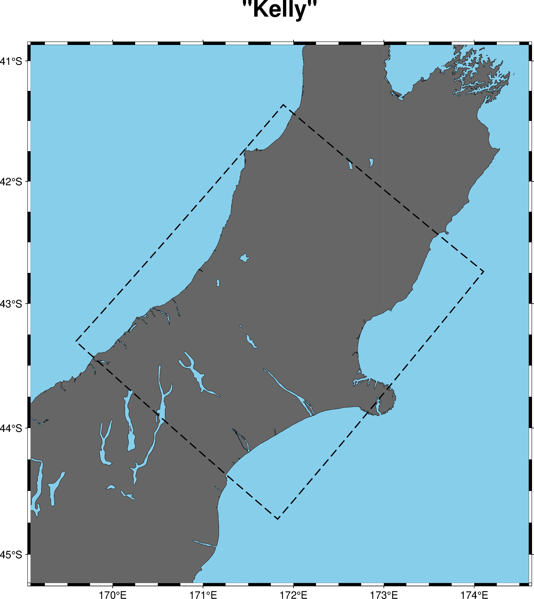
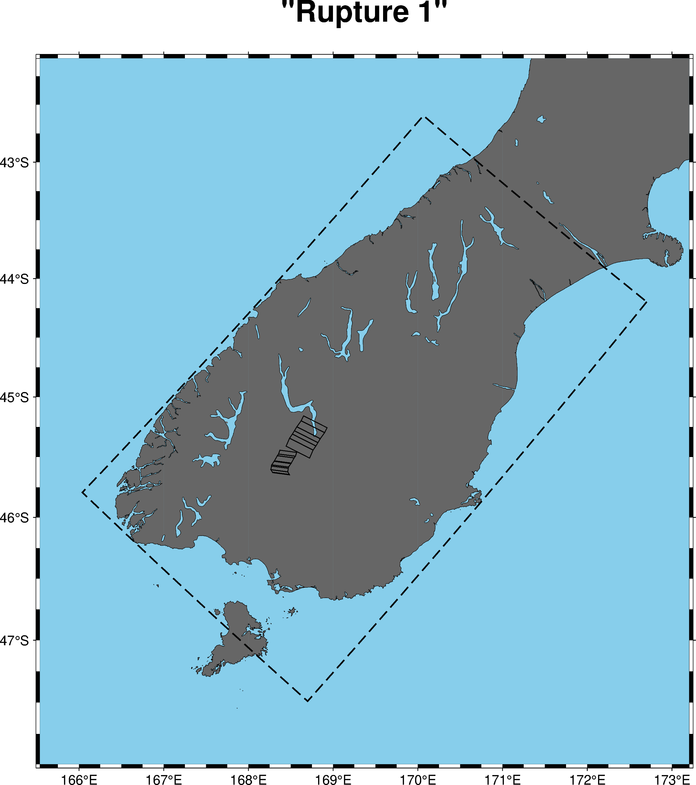
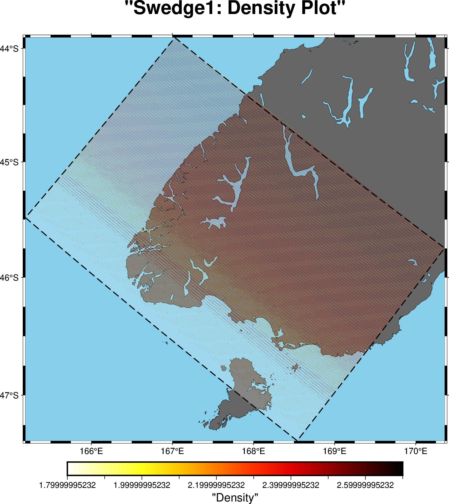
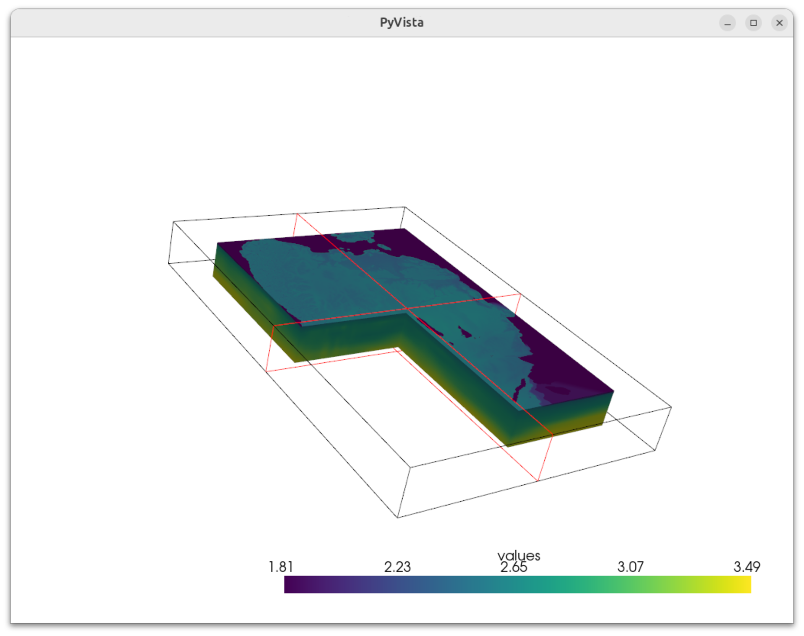

# Plotting Velocity Models

To plot the domain of a velocity model, you have three options
depending on the definition of the velocity model you have. No matter
the definition, you are going to be using the `plot-velocity-model` script.

## I Have a Legacy VM Params YAML File

In this case, you can supply the velocity model parameters file as a path

```bash
plot-velocity-model vm-params vm_params.yaml --title 'Kelly' --latitude-pad 0.5 --longitude-pad 0.5 output.png
```

If your `vm_params.yaml` contained a model definition like so:

```yaml
GRIDFILE: /scale_wlg_nobackup/filesets/nobackup/nesi00213/RunFolder/Cybershake/v24p6/Data/VMs/Kelly/gridfile_rt01-h0.200
GRIDOUT: /scale_wlg_nobackup/filesets/nobackup/nesi00213/RunFolder/Cybershake/v24p6/Data/VMs/Kelly/gridout_rt01-h0.200
MODEL_BOUNDS: /scale_wlg_nobackup/filesets/nobackup/nesi00213/RunFolder/Cybershake/v24p6/Data/VMs/Kelly/model_bounds_rt01-h0.200
MODEL_COORDS: /scale_wlg_nobackup/filesets/nobackup/nesi00213/RunFolder/Cybershake/v24p6/Data/VMs/Kelly/model_coords_rt01-h0.200
MODEL_LAT: -43.044786079354274
MODEL_LON: 171.857787526969
MODEL_PARAMS: /scale_wlg_nobackup/filesets/nobackup/nesi00213/RunFolder/Cybershake/v24p6/Data/VMs/Kelly/model_params_rt01-h0.200
MODEL_ROT: 39.74765144299198
extent_x: 238.4
extent_y: 286.6
extent_zmax: 47.0
extent_zmin: 0.0
flo: 0.5
hh: 0.2
mag: 6.928469801045964
min_vs: 0.5
model_version: '2.03'
nx: 1192
ny: 1433
nz: 235
sim_duration: 101.95
sufx: _rt01-h0.200
topo_type: BULLDOZED
```

Then your output plot would look something like



## I Have a New Realisation JSON File

Like the `vm_params.yaml` case, you can pass the realisation JSON file
as a parameter to the velocity model plotting tool. Because the
realisation also contains a definition of the source geometry, this is
also plotted on the map.

```bash
plot-velocity-model realisation realisation.json --title 'Rupture 1' --latitude-pad 0.5 --longitude-pad 0.5 output.png
```

Here is an example of this for an automatically generated domain for rupture one in the NSHMDB.



# I Want to Plot the Velocity Model Contents over the Domain

Regardless of the specification you use for the velocity model, you
can additionally plot the velocity model contents over the domain with
the `--velocity-model-ffp` argument. You should supply the directory
of the velocity model, and then you can specify the velocity model
component (density, S-wave, P-wave) to swap what you are plotting. You
can tweak the z-slice to plot and the transparency of the plot as
well.


```bash
plot-velocity-model vm-params vm_params.yaml --title "Swedge1: Density Plot"  --velocity-model-ffp velocity_model_dir/ --component density output.png
```



# I Want a 3d View of the Velocity Model

The `view-velocity-model` tool can read a velocity model file and view its contents interactively in 3D. This may not run well if your model is particularly large or if you have a slow computer -- especially if you move the slices around. You can also configure the available slice controls between xy, yz, and xz slices. You must know the number of slices in the model's x, y and z axes. These you can either read from the `vm_params.yaml` for the old workflow, or from the realisation json file in the new workflow.

``` bash
view-velocity-model Velocity_Model/(rho3dfile.d or vp3dfile.p or vs3dfile.s) NX NY NZ
```


