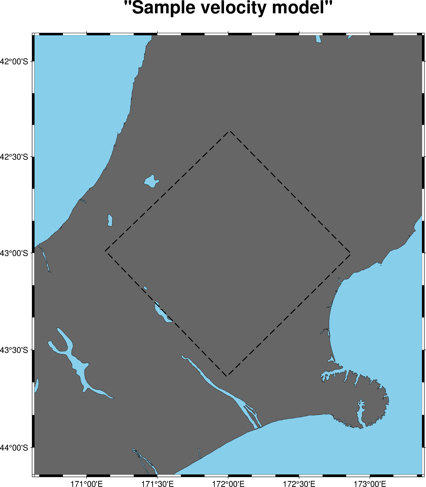

# Plotting Velocity Models

To plot the domain of a velocity model, you have three options
depending on the definition of the velocity model you have. No matter
the definition, you are going to be using the `plot-velocity-model` script.

## I Have a Legacy VM Params YAML File

In this case, you can supply the velocity model parameters file as a path

```bash
plot-velocity-model --vm-params-ffp vm_params.yaml --title 'Kelly' --latitude-pad 0.5 --longitude-pad 0.5 output.png
```

If your `vm_params.yaml` contained a model definition like so:

```yaml
GRIDFILE: /scale_wlg_nobackup/filesets/nobackup/nesi00213/RunFolder/Cybershake/v24p6/Data/VMs/Kelly/gridfile_rt01-h0.200
GRIDOUT: /scale_wlg_nobackup/filesets/nobackup/nesi00213/RunFolder/Cybershake/v24p6/Data/VMs/Kelly/gridout_rt01-h0.200
MODEL_BOUNDS: /scale_wlg_nobackup/filesets/nobackup/nesi00213/RunFolder/Cybershake/v24p6/Data/VMs/Kelly/model_bounds_rt01-h0.200
MODEL_COORDS: /scale_wlg_nobackup/filesets/nobackup/nesi00213/RunFolder/Cybershake/v24p6/Data/VMs/Kelly/model_coords_rt01-h0.200
MODEL_LAT: -43.044786079354274
MODEL_LON: 171.857787526969
MODEL_PARAMS: /scale_wlg_nobackup/filesets/nobackup/nesi00213/RunFolder/Cybershake/v24p6/Data/VMs/Kelly/model_params_rt01-h0.200
MODEL_ROT: 39.74765144299198
extent_x: 238.4
extent_y: 286.6
extent_zmax: 47.0
extent_zmin: 0.0
flo: 0.5
hh: 0.2
mag: 6.928469801045964
min_vs: 0.5
model_version: '2.03'
nx: 1192
ny: 1433
nz: 235
sim_duration: 101.95
sufx: _rt01-h0.200
topo_type: BULLDOZED
```

Then your output plot would look something like


## I Have a New Realisation JSON File

Like the `vm_params.yaml` case, you can pass the realisation JSON file
as parameter to the velocity model plotting tool. Because the
realisation also contains a definition of the source geometry, this is
also plotted on the map.

```bash
plot-velocity-model --realisation-ffp realisation.json --title 'Rupture 1' --latitude-pad 0.5 --longitude-pad 0.5 output.png
```

Here is an example of this for an automatically generated domain for rupture one in the NSHMDB.


## I Want to Plot a Custom Domain

Then you need to supply **all** of the following as arguments

- The model origin latitude.
- The model origin longitude.
- The model bearing.
- The model extents (in x and y-directions).

For example, a simple 100 x 100 km domain could be plotted like so

```bash
plot-velocity-model --centre-lon 172 --centre-lat -43 --extent-x 100 --extent-y 100 --bearing 45  --title 'Sample velocity model' --latitude-pad 0.5 --longitude-pad 0.5 output.png
```

The above command would produce an output like:



# I Want to Plot the Velocity Mode Contents over the Domain

Regardless of the specification you use for the velocity model, you
can additionally plot the velocity model contents over the domain with
the `--velocity-model-ffp` argument. You should supply the directory
of the velocity model, and then you can specify the velocity model
component (density, S-wave, P-wave) to swap what you are plotting. You
can tweak the z-slice to plot and the transparency of the plot as
well.


```bash
plot-velocity-model --title "Swedge1: Density Plot" --vm-params-ffp vm_params.yaml --velocity-model-ffp velocity_model_dir/ --component density output.png
```


