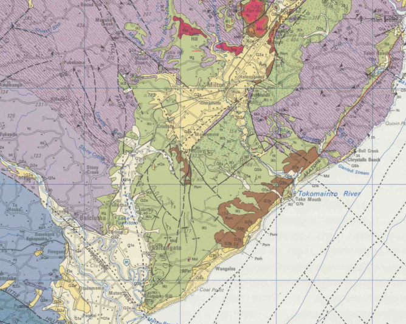

# Basin : Balclutha

## Overview
|         |                     |
|---------|---------------------|
| Version | 20p7           |
| Type    | 1        |
| Author  | Cameron Douglas (USER2020)            |
| Created | 2020-07           |

## Images

*Figure 1 Location*

*Figure 2 Balclutha Basin Map*

*Figure 3 Green Class*

*Figure 4 Green Rock*

## Notes
- Green area (in green_rock.png) tentatively regarded as a sedimentary rock (soft rock)
- Implemented as two separate basins (Mosgiel/Balclutha) joined by the sedimentary rock
- May need more rigorous classification

## Data
### Boundaries
- [Balclutha_outline_WGS84.txt](../../velocity_modelling/cvm/data/regional/Balclutha/Balclutha_outline_WGS84.txt)

### Surfaces
- [NZ_DEM_HD.in](../../velocity_modelling/cvm/data/global/surface/NZ_DEM_HD.in) (Submodel: canterbury1d_v2)
- [Balclutha_basement_WGS84.in](../../velocity_modelling/cvm/data/regional/Balclutha/Balclutha_basement_WGS84.in) (Submodel: N/A)

### Smoothing Boundaries
- [Balclutha_smoothing.txt](../../velocity_modelling/cvm/data/regional/Balclutha/Balclutha_smoothing.txt)

## Data retrieved from
### Boundaries
- [bal_outline_WGS84.txt](https://github.com/ucgmsim/Velocity-Model/tree/main/Data/USER20_BASINS/bal_outline_WGS84.txt)

### Surfaces
- [NZ_DEM_HD.in](https://github.com/ucgmsim/Velocity-Model/tree/main/Data/DEM/NZ_DEM_HD.in)
- [bal_proj_WGS84.in](https://github.com/ucgmsim/Velocity-Model/tree/main/Data/USER20_BASINS/bal_proj_WGS84.in)

---
*Page generated on: March 22, 2025, 19:41 NZST/NZDT*
