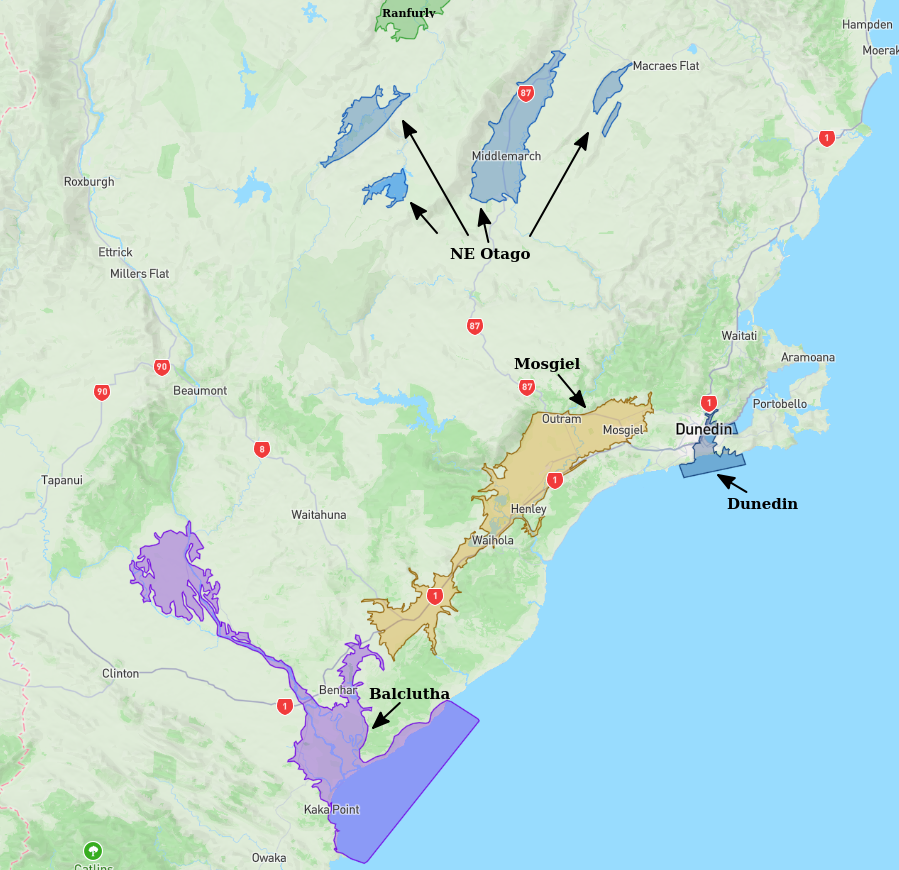
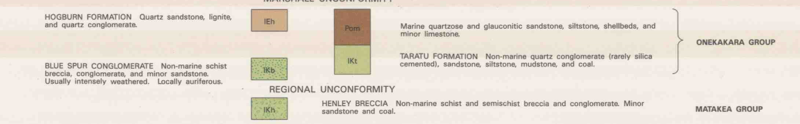

# Basin : Balclutha

## Overview
|         |                     |
|---------|---------------------|
| Version | 20p7           |
| Type    | 1        |
| Author  | Cameron Douglas (USER2020)            |
| Created | 2020-07           |

## Images
 Location
 Balclutha Basement

## Notes
- Green area (in green_rock.png) tentatively regarded as a sedimentary rock (soft rock)
- Implemented as two separate basins (Mosgiel/Balclutha) joined by the sedimentary rock
- May need more rigorous classification

## Data
### Boundaries
- [bal_outline_WGS84.txt](../../velocity_modelling/Data/USER20_BASINS/bal_outline_WGS84.txt)

### Surfaces
- [NZ_DEM](../../velocity_modelling/Data/DEM/NZ_DEM_HD.in) (Submodel: canterbury1d_v2)
- [BalcluthaBasement](../../velocity_modelling/Data/USER20_BASINS/bal_proj_WGS84.in) (Submodel: N/A)

### Smoothing Boundaries
- [Balclutha_v20p7.txt](../../velocity_modelling/Data/Boundaries/Smoothing/Balclutha_v20p7.txt)

---
*Page generated on: March 19, 2025, 12:34 NZST/NZDT*
