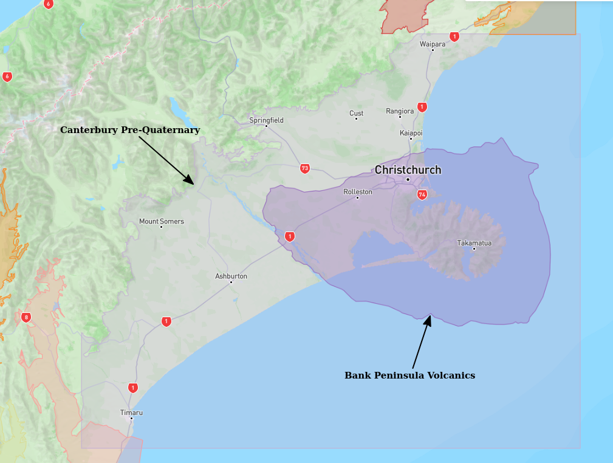
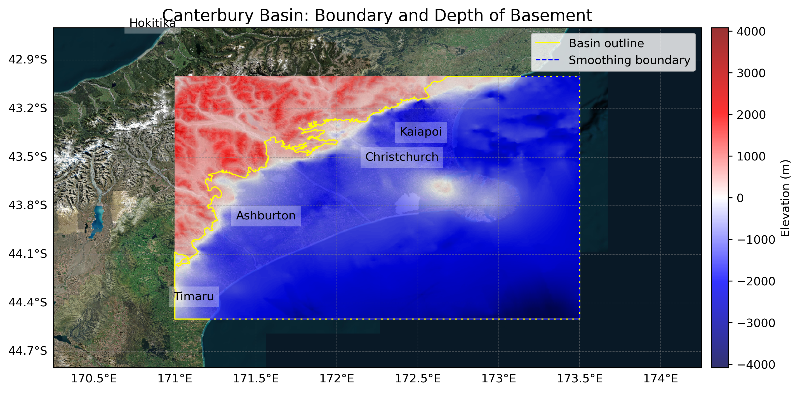

# Basin : Canterbury

## Overview
|         |                     |
|---------|---------------------|
| Version | 19p1           |
| Type    | 4        |
| Author  | Robin Lee            |
| Created | 2019-01           |
| Older Versions | 18p1, 18p2, 18p3 |

## Images

*Figure 1 Location*

*Figure 2 Canterbury Basin Map*

## Notes
- Pre-Quaternary geology

## Data
### Boundaries
- Canterbury_outline_WGS84 : [TXT](../../velocity_modelling/data/regional/Canterbury/Canterbury_outline_WGS84.txt) / [GeoJSON](../../velocity_modelling/data/regional/Canterbury/Canterbury_outline_WGS84.geojson)

### Surfaces
- CantDEM : [HDF5](../../velocity_modelling/data/global/surface/CantDEM.h5) / [TXT](../../velocity_modelling/data/global/surface/CantDEM.in) (Submodel: canterbury1d_v2_pliocene_enforced)
- Canterbury_Pliocene_46_WGS84_v8p9p18 : [HDF5](../../velocity_modelling/data/regional/Canterbury/Canterbury_Pliocene_46_WGS84_v8p9p18.h5) / [TXT](../../velocity_modelling/data/regional/Canterbury/Canterbury_Pliocene_46_WGS84_v8p9p18.in) (Submodel: pliocene_submod_v1)
- Canterbury_Miocene_WGS84 : [HDF5](../../velocity_modelling/data/regional/Canterbury/Canterbury_Miocene_WGS84.h5) / [TXT](../../velocity_modelling/data/regional/Canterbury/Canterbury_Miocene_WGS84.in) (Submodel: miocene_submod_v1)
- Canterbury_Paleogene_WGS84 : [HDF5](../../velocity_modelling/data/regional/Canterbury/Canterbury_Paleogene_WGS84.h5) / [TXT](../../velocity_modelling/data/regional/Canterbury/Canterbury_Paleogene_WGS84.in) (Submodel: paleogene_submod_v1)
- Canterbury_basement_WGS84 : [HDF5](../../velocity_modelling/data/regional/Canterbury/Canterbury_basement_WGS84.h5) / [TXT](../../velocity_modelling/data/regional/Canterbury/Canterbury_basement_WGS84.in) (Submodel: N/A)

### Smoothing Boundaries
- [Canterbury_smoothing.txt](../../velocity_modelling/data/regional/Canterbury/Canterbury_smoothing.txt)

## Data retrieved from
### Boundaries
- [NewCanterburyBasinBoundary_WGS84_1m.txt](https://github.com/ucgmsim/Velocity-Model/tree/main/Data/Boundaries/NewCanterburyBasinBoundary_WGS84_1m.txt)

### Surfaces
- [CantDEM.in](https://github.com/ucgmsim/Velocity-Model/tree/main/Data/DEM/CantDEM.in)
- [Pliocene_46_v8p9p18.in](https://github.com/ucgmsim/Velocity-Model/tree/main/Data/Canterbury_Basin/Pre_Quaternary/Pliocene_46_v8p9p18.in)
- [MioceneTop.in](https://github.com/ucgmsim/Velocity-Model/tree/main/Data/Canterbury_Basin/Pre_Quaternary/MioceneTop.in)
- [PaleogeneTop.in](https://github.com/ucgmsim/Velocity-Model/tree/main/Data/Canterbury_Basin/Pre_Quaternary/PaleogeneTop.in)
- [BasementTop.in](https://github.com/ucgmsim/Velocity-Model/tree/main/Data/Canterbury_Basin/Quaternary/BasementTop.in)

---
*Page generated on: June 18, 2025, 17:14 NZST/NZDT*
