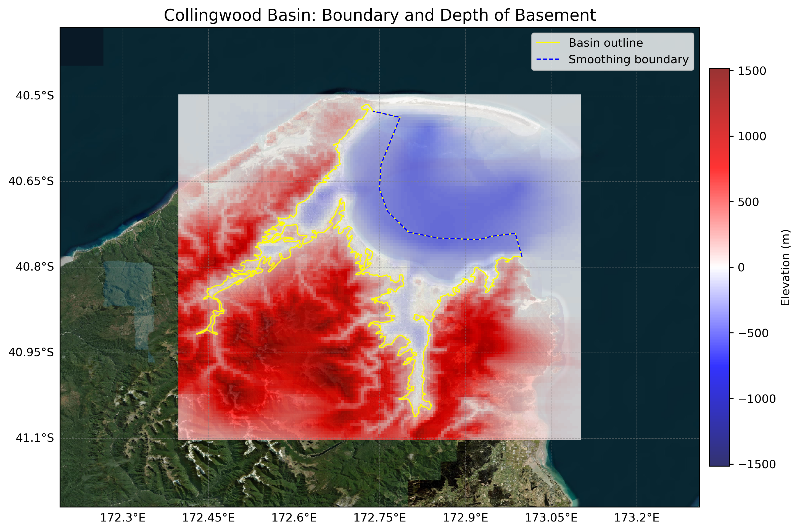

# Basin : Collingwood

## Overview
|         |                     |
|---------|---------------------|
| Version | 20p11           |
| Type    | 1        |
| Author  | Tim Tuckey (USER2020)            |
| Created | 2020-11           |

## Images

*Figure 1 Location*

*Figure 2 Collingwood Basin Map*

## Data
### Boundaries
- Collingwood_outline_WGS84_1 : [TXT](../../velocity_modelling/data/regional/Collingwood/Collingwood_outline_WGS84_1.txt) / [GeoJSON](../../velocity_modelling/data/regional/Collingwood/Collingwood_outline_WGS84_1.geojson)
- Collingwood_outline_WGS84_2 : [TXT](../../velocity_modelling/data/regional/Collingwood/Collingwood_outline_WGS84_2.txt) / [GeoJSON](../../velocity_modelling/data/regional/Collingwood/Collingwood_outline_WGS84_2.geojson)
- Collingwood_outline_WGS84_3 : [TXT](../../velocity_modelling/data/regional/Collingwood/Collingwood_outline_WGS84_3.txt) / [GeoJSON](../../velocity_modelling/data/regional/Collingwood/Collingwood_outline_WGS84_3.geojson)

### Surfaces
- NZ_DEM_HD : [HDF5](../../velocity_modelling/data/global/surface/NZ_DEM_HD.h5) / [TXT](../../velocity_modelling/data/global/surface/NZ_DEM_HD.in) (Submodel: canterbury1d_v2)
- Collingwood_basement_WGS84 : [HDF5](../../velocity_modelling/data/regional/Collingwood/Collingwood_basement_WGS84.h5) / [TXT](../../velocity_modelling/data/regional/Collingwood/Collingwood_basement_WGS84.in) (Submodel: N/A)

### Smoothing Boundaries
- [Collingwood_smoothing.txt](../../velocity_modelling/data/regional/Collingwood/Collingwood_smoothing.txt)

## Data retrieved from
### Boundaries
- [CollingwoodBasinOutline_1_WGS84_v1.txt](https://github.com/ucgmsim/Velocity-Model/tree/main/Data/USER20_BASINS/CollingwoodBasinOutline_1_WGS84_v1.txt)
- [CollingwoodBasinOutline_2_WGS84_v1.txt](https://github.com/ucgmsim/Velocity-Model/tree/main/Data/USER20_BASINS/CollingwoodBasinOutline_2_WGS84_v1.txt)
- [CollingwoodBasinOutline_3_WGS84_v1.txt](https://github.com/ucgmsim/Velocity-Model/tree/main/Data/USER20_BASINS/CollingwoodBasinOutline_3_WGS84_v1.txt)

### Surfaces
- [NZ_DEM_HD.in](https://github.com/ucgmsim/Velocity-Model/tree/main/Data/DEM/NZ_DEM_HD.in)
- [CollTakBasin_WGS84_500m_v11v11v2020.in](https://github.com/ucgmsim/Velocity-Model/tree/main/Data/USER20_BASINS/CollTakBasin_WGS84_500m_v11v11v2020.in)

---
*Page generated on: June 10, 2025, 10:08 NZST/NZDT*
