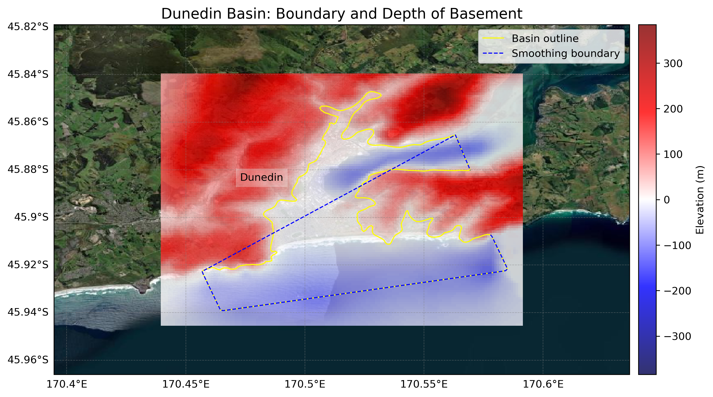
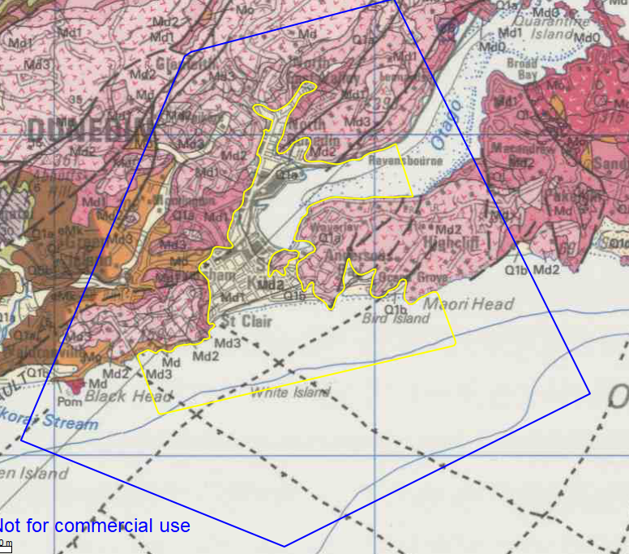

# Basin : Dunedin

## Overview
|         |                     |
|---------|---------------------|
| Version | 20p7           |
| Type    | 1        |
| Author  | Cameron Douglas (USER2020)            |
| Created | 2020-07           |

## Images

*Figure 1 Location*

*Figure 2 Dunedin Basin Map*

*Figure 3 Dunedin Outline*

## Notes
- Port Chalmers needs an update.
- Inlets need to be modelled.

## Data
### Boundaries
- Dunedin_outline_WGS84 : [TXT](../../velocity_modelling/data/regional/Dunedin/Dunedin_outline_WGS84.txt) / [GeoJSON](../../velocity_modelling/data/regional/Dunedin/Dunedin_outline_WGS84.geojson)

### Surfaces
- NZ_DEM_HD : [HDF5](../../velocity_modelling/data/global/surface/NZ_DEM_HD.h5) / [TXT](../../velocity_modelling/data/global/surface/NZ_DEM_HD.in) (Submodel: canterbury1d_v2)
- Dunedin_basement_WGS84 : [HDF5](../../velocity_modelling/data/regional/Dunedin/Dunedin_basement_WGS84.h5) / [TXT](../../velocity_modelling/data/regional/Dunedin/Dunedin_basement_WGS84.in) (Submodel: N/A)

### Smoothing Boundaries
- [Dunedin_smoothing.txt](../../velocity_modelling/data/regional/Dunedin/Dunedin_smoothing.txt)

## Data retrieved from
### Boundaries
- [dun_outline_WGS84.txt](https://github.com/ucgmsim/Velocity-Model/tree/main/Data/USER20_BASINS/dun_outline_WGS84.txt)

### Surfaces
- [NZ_DEM_HD.in](https://github.com/ucgmsim/Velocity-Model/tree/main/Data/DEM/NZ_DEM_HD.in)
- [dun_proj_WGS84.in](https://github.com/ucgmsim/Velocity-Model/tree/main/Data/USER20_BASINS/dun_proj_WGS84.in)

---
*Page generated on: March 28, 2025, 16:34 NZST/NZDT*
