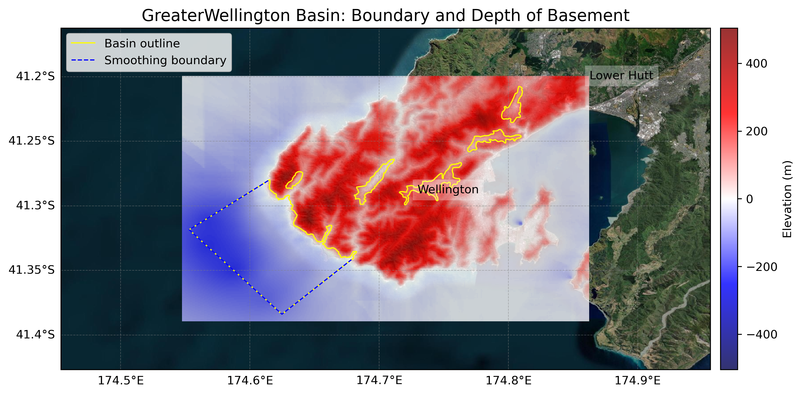
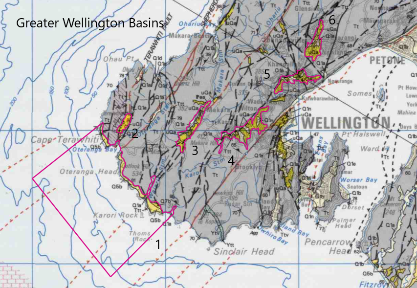

# Basin : GreaterWellington

## Overview
|         |                     |
|---------|---------------------|
| Version | 21p7           |
| Type    | 1        |
| Author  | William Lee (USER2021)            |
| Created | 2021-07           |

## Images

*Figure 1 Location*

*Figure 2 Greaterwellington Basin Map*

*Figure 3 Greater Wellington Outline*

## Data
### Boundaries
- [GreaterWellington_outline_WGS84_1.txt](../../velocity_modelling/cvm/data/regional/GreaterWellington/GreaterWellington_outline_WGS84_1.txt)
- [GreaterWellington_outline_WGS84_2.txt](../../velocity_modelling/cvm/data/regional/GreaterWellington/GreaterWellington_outline_WGS84_2.txt)
- [GreaterWellington_outline_WGS84_3.txt](../../velocity_modelling/cvm/data/regional/GreaterWellington/GreaterWellington_outline_WGS84_3.txt)
- [GreaterWellington_outline_WGS84_4.txt](../../velocity_modelling/cvm/data/regional/GreaterWellington/GreaterWellington_outline_WGS84_4.txt)
- [GreaterWellington_outline_WGS84_5.txt](../../velocity_modelling/cvm/data/regional/GreaterWellington/GreaterWellington_outline_WGS84_5.txt)
- [GreaterWellington_outline_WGS84_6.txt](../../velocity_modelling/cvm/data/regional/GreaterWellington/GreaterWellington_outline_WGS84_6.txt)

### Surfaces
- [NZ_DEM_HD.in](../../velocity_modelling/cvm/data/global/surface/NZ_DEM_HD.in) (Submodel: canterbury1d_v2)
- [GreaterWellington_basement_WGS84.in](../../velocity_modelling/cvm/data/regional/GreaterWellington/GreaterWellington_basement_WGS84.in) (Submodel: N/A)

### Smoothing Boundaries
- [GreaterWellington_smoothing.txt](../../velocity_modelling/cvm/data/regional/GreaterWellington/GreaterWellington_smoothing.txt)

## Data retrieved from
### Boundaries
- [GreaterWellington1_Outline_WGS84.dat](https://github.com/ucgmsim/Velocity-Model/tree/main/Data/Basins/Greater_Wellington_and_Porirua/v21p7/GreaterWellington1_Outline_WGS84.dat)
- [GreaterWellington2_Outline_WGS84.dat](https://github.com/ucgmsim/Velocity-Model/tree/main/Data/Basins/Greater_Wellington_and_Porirua/v21p7/GreaterWellington2_Outline_WGS84.dat)
- [GreaterWellington3_Outline_WGS84.dat](https://github.com/ucgmsim/Velocity-Model/tree/main/Data/Basins/Greater_Wellington_and_Porirua/v21p7/GreaterWellington3_Outline_WGS84.dat)
- [GreaterWellington4_Outline_WGS84.dat](https://github.com/ucgmsim/Velocity-Model/tree/main/Data/Basins/Greater_Wellington_and_Porirua/v21p7/GreaterWellington4_Outline_WGS84.dat)
- [GreaterWellington5_Outline_WGS84.dat](https://github.com/ucgmsim/Velocity-Model/tree/main/Data/Basins/Greater_Wellington_and_Porirua/v21p7/GreaterWellington5_Outline_WGS84.dat)
- [GreaterWellington6_Outline_WGS84.dat](https://github.com/ucgmsim/Velocity-Model/tree/main/Data/Basins/Greater_Wellington_and_Porirua/v21p7/GreaterWellington6_Outline_WGS84.dat)

### Surfaces
- [NZ_DEM_HD.in](https://github.com/ucgmsim/Velocity-Model/tree/main/Data/DEM/NZ_DEM_HD.in)
- [Greater_Wellington_Elevation_WGS84.in](https://github.com/ucgmsim/Velocity-Model/tree/main/Data/Basins/Greater_Wellington_and_Porirua/v21p7/Greater_Wellington_Elevation_WGS84.in)

---
*Page generated on: March 22, 2025, 19:41 NZST/NZDT*
