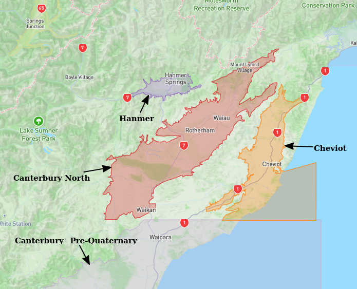
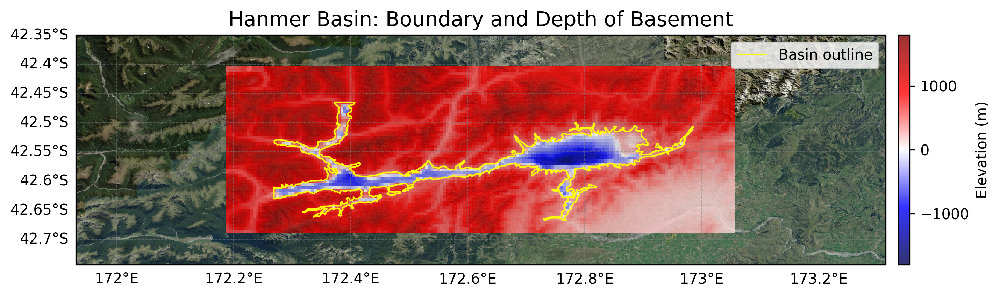

# Basin : Hanmer

## Overview
|         |                     |
|---------|---------------------|
| Version | 25p3           |
| Type    | 1        |
| Author  | Ayushi Tiwari / Robin Lee            |
| Created | 2025-03           |
| Older Versions | 19p1 |

## Images

*Figure 1 Location*

*Figure 2 Hanmer Basin Map V25p5*

## Data
### Boundaries
- Hanmer_outline_WGS84_v25p3 : [TXT](../../velocity_modelling/data/regional/Hanmer/Hanmer_outline_WGS84_v25p3.txt) / [GeoJSON](../../velocity_modelling/data/regional/Hanmer/Hanmer_outline_WGS84_v25p3.geojson)

### Surfaces
- NZ_DEM_HD : [HDF5](../../velocity_modelling/data/global/surface/NZ_DEM_HD.h5) / [TXT](../../velocity_modelling/data/global/surface/NZ_DEM_HD.in) (Submodel: canterbury1d_v2)
- Hanmer_basement_WGS84_v25p3 : [HDF5](../../velocity_modelling/data/regional/Hanmer/Hanmer_basement_WGS84_v25p3.h5) / [TXT](../../velocity_modelling/data/regional/Hanmer/Hanmer_basement_WGS84_v25p3.in) (Submodel: N/A)

---
*Page generated on: June 10, 2025, 10:08 NZST/NZDT*
