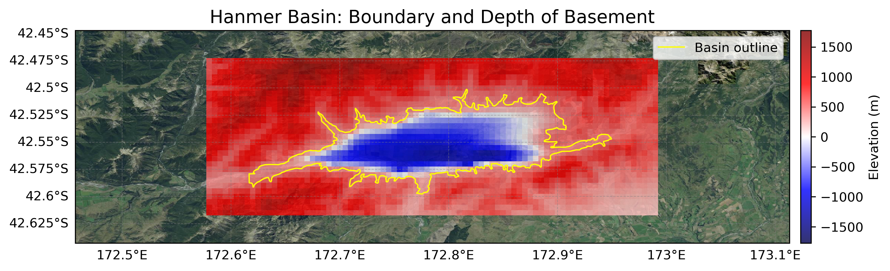

# Basin : Hanmer

## Overview
|         |                     |
|---------|---------------------|
| Version | 19p1           |
| Type    | 2        |
| Author  | Robin Lee            |
| Created | 2019-01           |

## Images

*Figure 1 Location*

*Figure 2 Hanmer Basin Map*

*Figure 3 Hanmer Basement*

## Data
### Boundaries
- Hanmer_outline_WGS84 : [TXT](../../velocity_modelling/data/regional/Hanmer/Hanmer_outline_WGS84.txt) / [GeoJSON](../../velocity_modelling/data/regional/Hanmer/Hanmer_outline_WGS84.geojson)

### Surfaces
- NZ_DEM_HD : [HDF5](../../velocity_modelling/data/global/surface/NZ_DEM_HD.h5) / [TXT](../../velocity_modelling/data/global/surface/NZ_DEM_HD.in) (Submodel: canterbury1d_v2)
- Hanmer_basement_WGS84 : [HDF5](../../velocity_modelling/data/regional/Hanmer/Hanmer_basement_WGS84.h5) / [TXT](../../velocity_modelling/data/regional/Hanmer/Hanmer_basement_WGS84.in) (Submodel: N/A)

## Data retrieved from
### Boundaries
- [Hanmer_Polygon_WGS84.txt](https://github.com/ucgmsim/Velocity-Model/tree/main/Data/SI_BASINS/Hanmer_Polygon_WGS84.txt)

### Surfaces
- [NZ_DEM_HD.in](https://github.com/ucgmsim/Velocity-Model/tree/main/Data/DEM/NZ_DEM_HD.in)
- [Hanmer_Basement_WGS84_v0p0.in](https://github.com/ucgmsim/Velocity-Model/tree/main/Data/SI_BASINS/Hanmer_Basement_WGS84_v0p0.in)

---
*Page generated on: April 15, 2025, 11:17 NZST/NZDT*
