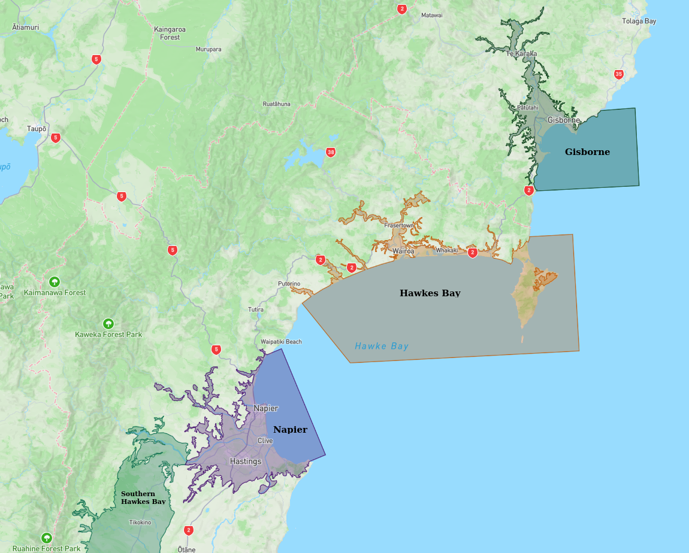
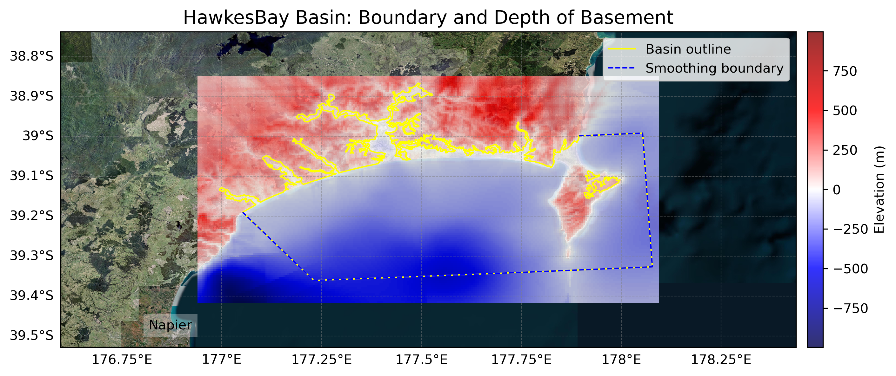
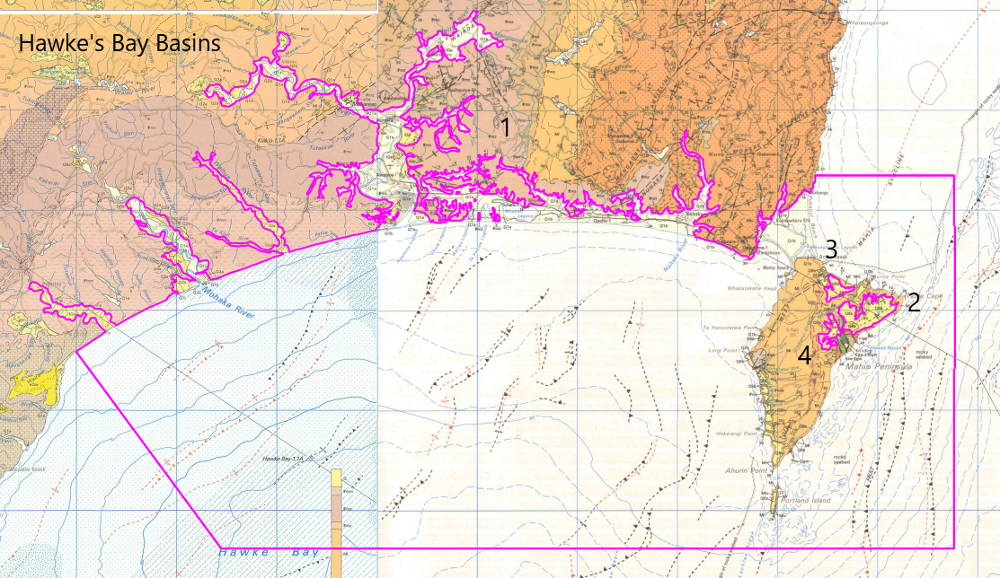
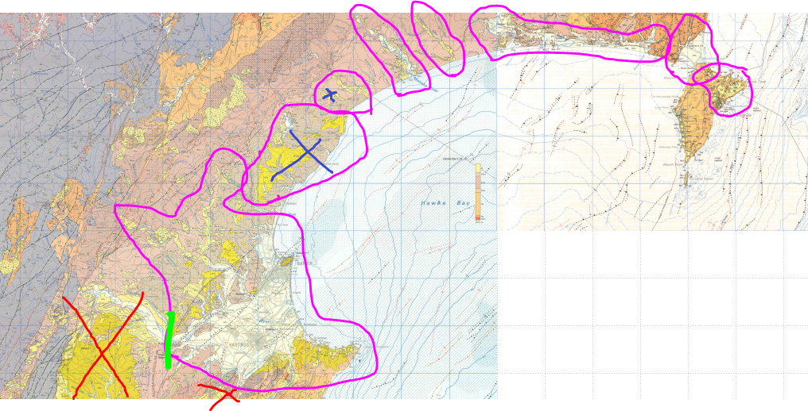

# Basin : HawkesBay

## Overview
|         |                     |
|---------|---------------------|
| Version | 21p7           |
| Type    | 1        |
| Author  | William Lee (USER2021)            |
| Created | 2021-07           |

## Images

*Figure 1 Location*

*Figure 2 Hawkesbay Basin Map*

*Figure 3 Hawkes Bay Outline*

*Figure 4 Hawkes Bay Outline Edited*

## Notes
- (Comment from the author) "The areas marked with black X's were either considered too shallow or sedimentary rock so weren't modelled as a basin."

## Data
### Boundaries
- HawkesBay_outline_WGS84_1 : [TXT](../../velocity_modelling/data/regional/HawkesBay/HawkesBay_outline_WGS84_1.txt) / [GeoJSON](../../velocity_modelling/data/regional/HawkesBay/HawkesBay_outline_WGS84_1.geojson)
- HawkesBay_outline_WGS84_2 : [TXT](../../velocity_modelling/data/regional/HawkesBay/HawkesBay_outline_WGS84_2.txt) / [GeoJSON](../../velocity_modelling/data/regional/HawkesBay/HawkesBay_outline_WGS84_2.geojson)
- HawkesBay_outline_WGS84_3 : [TXT](../../velocity_modelling/data/regional/HawkesBay/HawkesBay_outline_WGS84_3.txt) / [GeoJSON](../../velocity_modelling/data/regional/HawkesBay/HawkesBay_outline_WGS84_3.geojson)
- HawkesBay_outline_WGS84_4 : [TXT](../../velocity_modelling/data/regional/HawkesBay/HawkesBay_outline_WGS84_4.txt) / [GeoJSON](../../velocity_modelling/data/regional/HawkesBay/HawkesBay_outline_WGS84_4.geojson)

### Surfaces
- NZ_DEM_HD : [HDF5](../../velocity_modelling/data/global/surface/NZ_DEM_HD.h5) / [TXT](../../velocity_modelling/data/global/surface/NZ_DEM_HD.in) (Submodel: canterbury1d_v2)
- HawkesBay_basement_WGS84 : [HDF5](../../velocity_modelling/data/regional/HawkesBay/HawkesBay_basement_WGS84.h5) / [TXT](../../velocity_modelling/data/regional/HawkesBay/HawkesBay_basement_WGS84.in) (Submodel: N/A)

### Smoothing Boundaries
- [HawkesBay_smoothing.txt](../../velocity_modelling/data/regional/HawkesBay/HawkesBay_smoothing.txt)

## Data retrieved from
### Boundaries
- [HawkesBay1_Outline_WGS84_delim.dat](https://github.com/ucgmsim/Velocity-Model/tree/main/Data/Basins/Napier_Hawkes_Bay/v21p7/HawkesBay1_Outline_WGS84_delim.dat)
- [HawkesBay2_Outline_WGS84_delim.dat](https://github.com/ucgmsim/Velocity-Model/tree/main/Data/Basins/Napier_Hawkes_Bay/v21p7/HawkesBay2_Outline_WGS84_delim.dat)
- [HawkesBay3_Outline_WGS84_delim.dat](https://github.com/ucgmsim/Velocity-Model/tree/main/Data/Basins/Napier_Hawkes_Bay/v21p7/HawkesBay3_Outline_WGS84_delim.dat)
- [HawkesBay4_Outline_WGS84_delim.dat](https://github.com/ucgmsim/Velocity-Model/tree/main/Data/Basins/Napier_Hawkes_Bay/v21p7/HawkesBay4_Outline_WGS84_delim.dat)
- [SpringsJ_basin_outline_v1_WGS84.txt](https://github.com/ucgmsim/Velocity-Model/tree/main/Data/USER20_BASINS/SpringsJ_basin_outline_v1_WGS84.txt)

### Surfaces
- [NZ_DEM_HD.in](https://github.com/ucgmsim/Velocity-Model/tree/main/Data/DEM/NZ_DEM_HD.in)
- [HawkesBay_Grid_WGS84_Export.in](https://github.com/ucgmsim/Velocity-Model/tree/main/Data/Basins/Napier_Hawkes_Bay/v21p7/HawkesBay_Grid_WGS84_Export.in)

---
*Page generated on: June 18, 2025, 17:14 NZST/NZDT*
