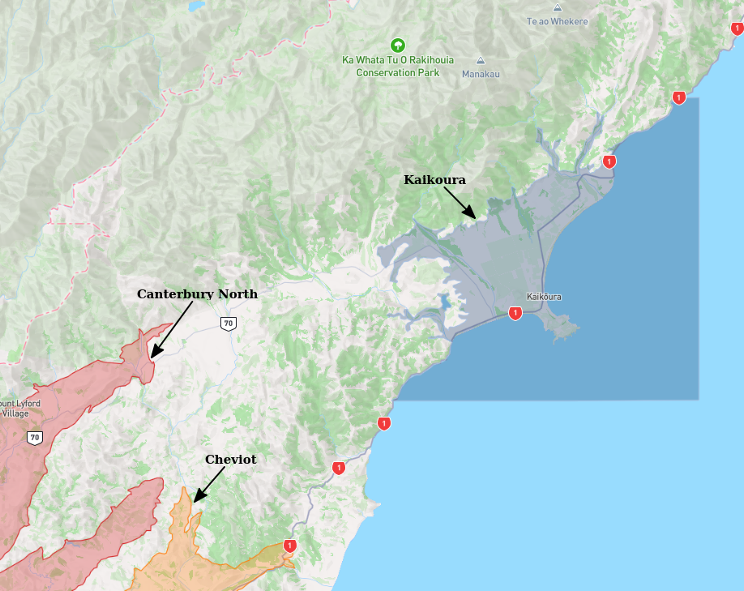

# Basin : Kaikoura

## Overview
|         |                     |
|---------|---------------------|
| Version | 19p1           |
| Type    | 2        |
| Author  | Ethan Thomson            |
| Created | 2019-01           |

## Images

*Figure 1 Location*

*Figure 2 Kaikoura Basement*

## Data
### Boundaries
- [Kaikoura_Polygon_WGS84.txt](../../velocity_modelling/Data/SI_BASINS/Kaikoura_Polygon_WGS84.txt)

### Surfaces
- [NZ_DEM](../../velocity_modelling/Data/DEM/NZ_DEM_HD.in) (Submodel: canterbury1d_v2)
- [KaikouraBasement](../../velocity_modelling/Data/SI_BASINS/Kaikoura_Basement_WGS84_v0p0.in) (Submodel: N/A)

### Smoothing Boundaries
- [Kaikoura_v19p1.txt](../../velocity_modelling/Data/Boundaries/Smoothing/Kaikoura_v19p1.txt)

---
*Page generated on: March 19, 2025, 12:47 NZST/NZDT*
