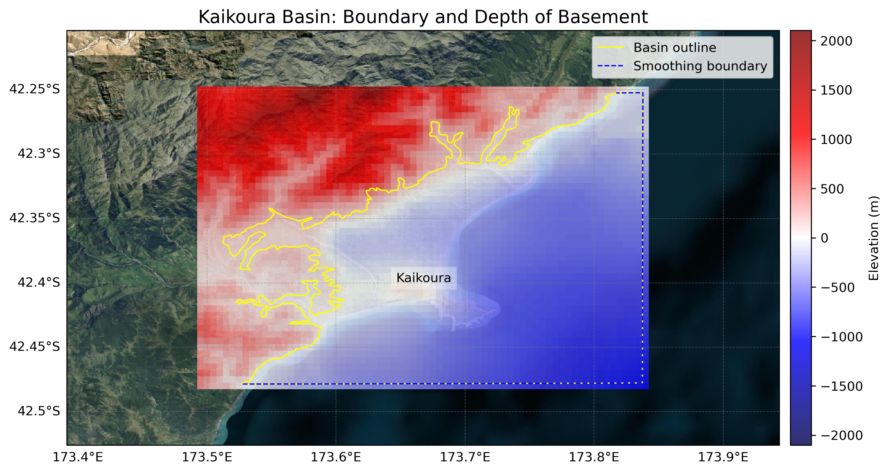

# Basin : Kaikoura

## Overview
|         |                     |
|---------|---------------------|
| Version | 19p1           |
| Type    | 2        |
| Author  | Robin Lee            |
| Created | 2019-01           |

## Images

*Figure 1 Location*

*Figure 2 Kaikoura Basin Map*

*Figure 3 Kaikoura Basement*

## Data
### Boundaries
- Kaikoura_outline_WGS84 : [TXT](../../velocity_modelling/data/regional/Kaikoura/Kaikoura_outline_WGS84.txt) / [GeoJSON](../../velocity_modelling/data/regional/Kaikoura/Kaikoura_outline_WGS84.geojson)

### Surfaces
- NZ_DEM_HD : [HDF5](../../velocity_modelling/data/global/surface/NZ_DEM_HD.h5) / [TXT](../../velocity_modelling/data/global/surface/NZ_DEM_HD.in) (Submodel: canterbury1d_v2)
- Kaikoura_basement_WGS84 : [HDF5](../../velocity_modelling/data/regional/Kaikoura/Kaikoura_basement_WGS84.h5) / [TXT](../../velocity_modelling/data/regional/Kaikoura/Kaikoura_basement_WGS84.in) (Submodel: N/A)

### Smoothing Boundaries
- [Kaikoura_smoothing.txt](../../velocity_modelling/data/regional/Kaikoura/Kaikoura_smoothing.txt)

## Data retrieved from
### Boundaries
- [Kaikoura_Polygon_WGS84.txt](https://github.com/ucgmsim/Velocity-Model/tree/main/Data/SI_BASINS/Kaikoura_Polygon_WGS84.txt)

### Surfaces
- [NZ_DEM_HD.in](https://github.com/ucgmsim/Velocity-Model/tree/main/Data/DEM/NZ_DEM_HD.in)
- [Kaikoura_Basement_WGS84_v0p0.in](https://github.com/ucgmsim/Velocity-Model/tree/main/Data/SI_BASINS/Kaikoura_Basement_WGS84_v0p0.in)

---
*Page generated on: March 28, 2025, 16:34 NZST/NZDT*
