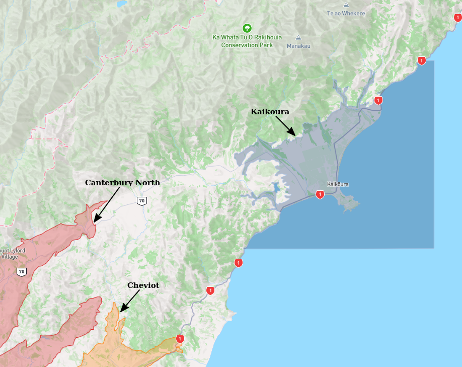
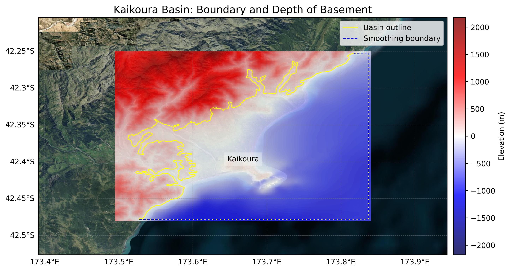

# Basin : Kaikoura

## Overview
|         |                     |
|---------|---------------------|
| Version | 25p5           |
| Type    | 2        |
| Author  | Robin Lee            |
| Created | 2025-05           |
| Older Versions | 19p1 |

## Images

*Figure 1 Location*

*Figure 2 Kaikoura Basin Map V25p5*

*Figure 3 Kaikoura Basement*

## Data
### Boundaries
- Kaikoura_outline_WGS84_v25p5 : [TXT](../../velocity_modelling/data/regional/Kaikoura/Kaikoura_outline_WGS84_v25p5.txt) / [GeoJSON](../../velocity_modelling/data/regional/Kaikoura/Kaikoura_outline_WGS84_v25p5.geojson)

### Surfaces
- NZ_DEM_HD : [HDF5](../../velocity_modelling/data/global/surface/NZ_DEM_HD.h5) / [TXT](../../velocity_modelling/data/global/surface/NZ_DEM_HD.in) (Submodel: canterbury1d_v2)
- Kaikoura_basement_WGS84_v25p5 : [HDF5](../../velocity_modelling/data/regional/Kaikoura/Kaikoura_basement_WGS84_v25p5.h5) / [TXT](../../velocity_modelling/data/regional/Kaikoura/Kaikoura_basement_WGS84_v25p5.in) (Submodel: N/A)

### Smoothing Boundaries
- [Kaikoura_smoothing_v25p5.txt](../../velocity_modelling/data/regional/Kaikoura/Kaikoura_smoothing_v25p5.txt)

---
*Page generated on: June 23, 2025, 13:10 NZST/NZDT*
