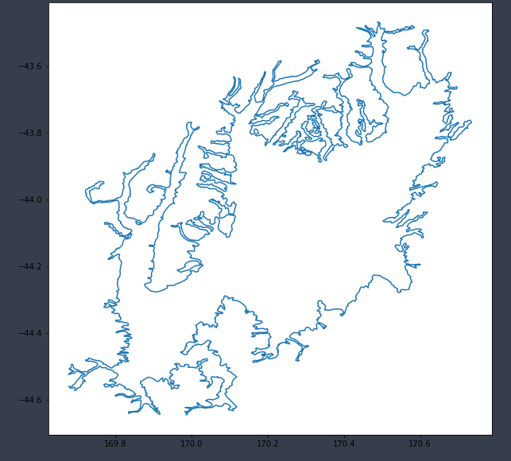

# Basin : Mackenzie

## Overview
|         |                     |
|---------|---------------------|
| Version | 20p6           |
| Type    | 1        |
| Author  | Cameron Douglas (USER2020)            |
| Created | 2020-06           |

## Images

*Figure 1 Location*

*Figure 2 Mackenzie Basin Map*

*Figure 3 Mackenzie Boundary*

## Data
### Boundaries
- [Mackenzie_outline_WGS84.txt](../../velocity_modelling/data/regional/Mackenzie/Mackenzie_outline_WGS84.txt)

### Surfaces
- [NZ_DEM_HD.in](../../velocity_modelling/data/global/surface/NZ_DEM_HD.in) (Submodel: canterbury1d_v2)
- [Mackenzie_basement_WGS84.in](../../velocity_modelling/data/regional/Mackenzie/Mackenzie_basement_WGS84.in) (Submodel: N/A)

## Data retrieved from
### Boundaries
- [mackenzie_basin_outline_nzmg.txt](https://github.com/ucgmsim/Velocity-Model/tree/main/Data/USER20_BASINS/mackenzie_basin_outline_nzmg.txt)

### Surfaces
- [NZ_DEM_HD.in](https://github.com/ucgmsim/Velocity-Model/tree/main/Data/DEM/NZ_DEM_HD.in)
- [mackenzie_proj_grid_WGS84.in](https://github.com/ucgmsim/Velocity-Model/tree/main/Data/USER20_BASINS/mackenzie_proj_grid_WGS84.in)

---
*Page generated on: March 22, 2025, 19:41 NZST/NZDT*
