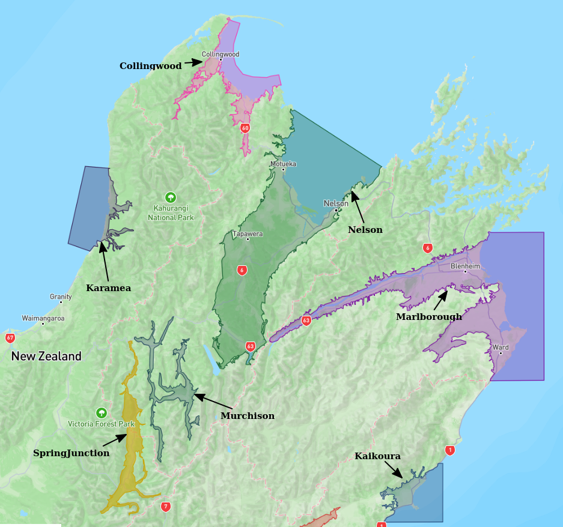
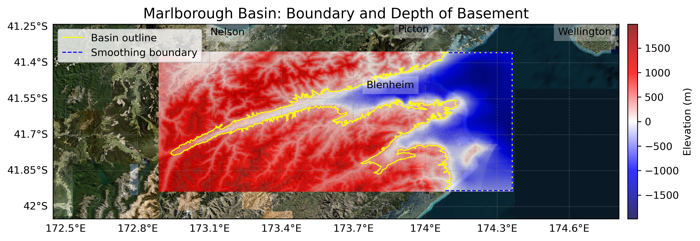

# Basin : Marlborough

## Overview
|         |                     |
|---------|---------------------|
| Version | 19p1           |
| Type    | 1        |
| Author  | Robin Lee            |
| Created | 2019-01           |

## Images

*Figure 1 Location*

*Figure 2 Marlborough Basin Map*

## Data
### Boundaries
- Marlborough_outline_WGS84 : [TXT](../../velocity_modelling/data/regional/Marlborough/Marlborough_outline_WGS84.txt) / [GeoJSON](../../velocity_modelling/data/regional/Marlborough/Marlborough_outline_WGS84.geojson)

### Surfaces
- NZ_DEM_HD : [HDF5](../../velocity_modelling/data/global/surface/NZ_DEM_HD.h5) / [TXT](../../velocity_modelling/data/global/surface/NZ_DEM_HD.in) (Submodel: canterbury1d_v2)
- Marlborough_basement_WGS84 : [HDF5](../../velocity_modelling/data/regional/Marlborough/Marlborough_basement_WGS84.h5) / [TXT](../../velocity_modelling/data/regional/Marlborough/Marlborough_basement_WGS84.in) (Submodel: N/A)

### Smoothing Boundaries
- [Marlborough_smoothing.txt](../../velocity_modelling/data/regional/Marlborough/Marlborough_smoothing.txt)

## Data retrieved from
### Boundaries
- [Marlborough_Polygon_WGS84_v0p1.txt](https://github.com/ucgmsim/Velocity-Model/tree/main/Data/SI_BASINS/Marlborough_Polygon_WGS84_v0p1.txt)

### Surfaces
- [NZ_DEM_HD.in](https://github.com/ucgmsim/Velocity-Model/tree/main/Data/DEM/NZ_DEM_HD.in)
- [Marlborough_Basement_WGS84_v0p1.in](https://github.com/ucgmsim/Velocity-Model/tree/main/Data/SI_BASINS/Marlborough_Basement_WGS84_v0p1.in)

---
*Page generated on: June 18, 2025, 17:14 NZST/NZDT*
