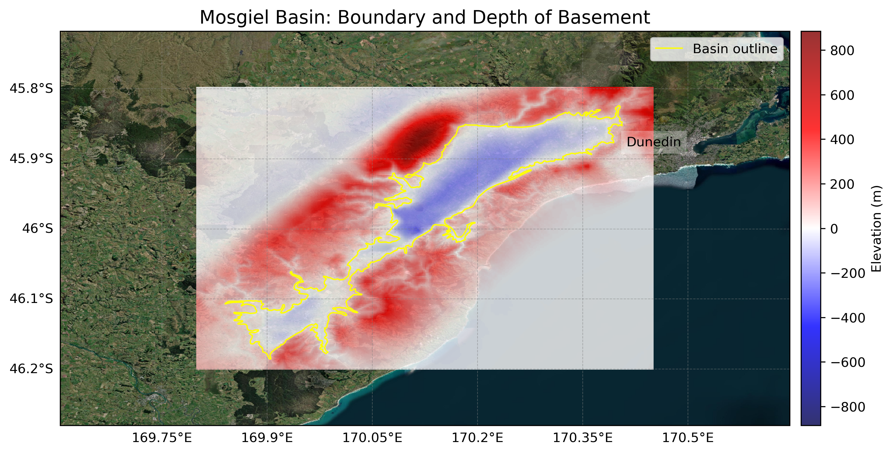

# Basin : Mosgiel

## Overview
|         |                     |
|---------|---------------------|
| Version | 20p7           |
| Type    | 1        |
| Author  | Cameron Douglas (USER2020)            |
| Created | 2020-07           |

## Images

*Figure 1 Location*

*Figure 2 Mosgiel Basin Map*

*Figure 3 Green Class*

*Figure 4 Green Rock*

## Notes
- Green area (in green_rock.png) tentatively regarded as a sedimentary rock (soft rock)
- Implemented as two separate basins (Mosgiel/Balclutha) joined by the sedimentary rock
- May need more rigorous classification

## Data
### Boundaries
- Mosgiel_outline_WGS84 : [TXT](../../velocity_modelling/data/regional/Mosgiel/Mosgiel_outline_WGS84.txt) / [GeoJSON](../../velocity_modelling/data/regional/Mosgiel/Mosgiel_outline_WGS84.geojson)

### Surfaces
- NZ_DEM_HD : [HDF5](../../velocity_modelling/data/global/surface/NZ_DEM_HD.h5) / [TXT](../../velocity_modelling/data/global/surface/NZ_DEM_HD.in) (Submodel: canterbury1d_v2)
- Mosgiel_basement_WGS84 : [HDF5](../../velocity_modelling/data/regional/Mosgiel/Mosgiel_basement_WGS84.h5) / [TXT](../../velocity_modelling/data/regional/Mosgiel/Mosgiel_basement_WGS84.in) (Submodel: N/A)

## Data retrieved from
### Boundaries
- [mos_outline_WGS84.txt](https://github.com/ucgmsim/Velocity-Model/tree/main/Data/USER20_BASINS/mos_outline_WGS84.txt)

### Surfaces
- [NZ_DEM_HD.in](https://github.com/ucgmsim/Velocity-Model/tree/main/Data/DEM/NZ_DEM_HD.in)
- [mos_proj_WGS84.in](https://github.com/ucgmsim/Velocity-Model/tree/main/Data/USER20_BASINS/mos_proj_WGS84.in)

---
*Page generated on: May 02, 2025, 15:33 NZST/NZDT*
