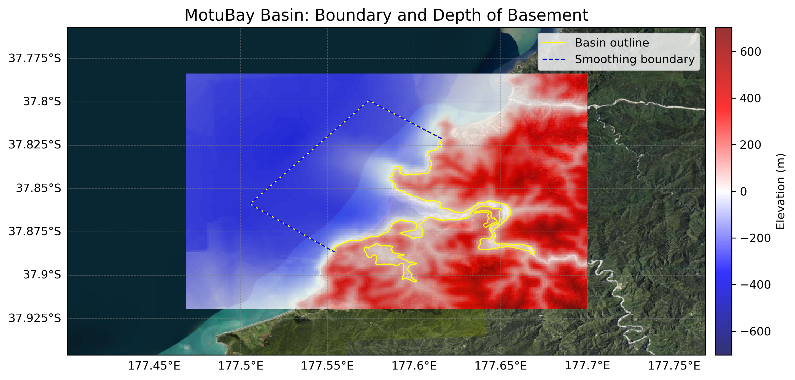
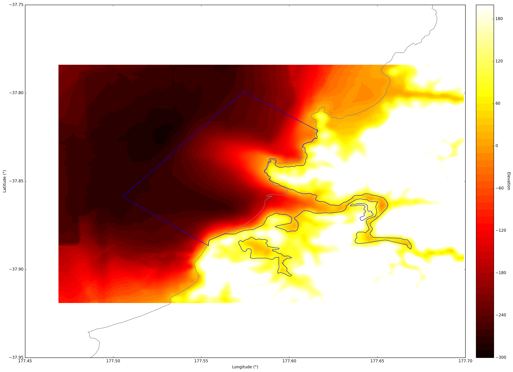
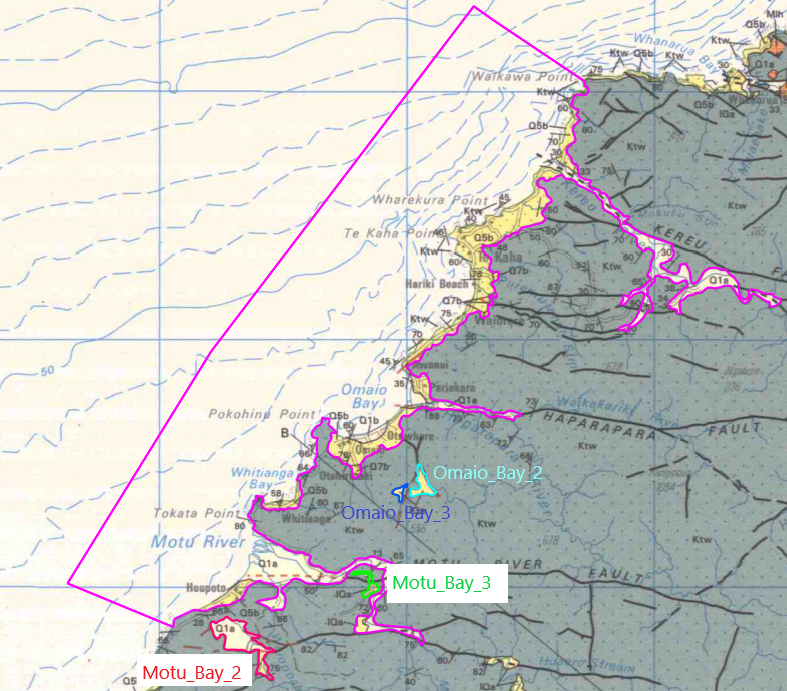

# Basin : MotuBay

## Overview
|         |                     |
|---------|---------------------|
| Version | 22p3           |
| Type    | 1        |
| Author  | Cameron Davis / Emma Coumbe (USER2022)            |
| Created | 2022-03           |

## Images

*Figure 1 Location*

*Figure 2 Motubay Basin Map*

*Figure 3 Motubay Basement*

*Figure 4 Moturiver Extended Outline*

*Figure 5 Eastcape Coastal River Valleys*

## Notes
- Rest of the coastal river valleys on the East Cape (Waiapu River, Hicks Bay, Waihau Bay, Motu River) to be added
- Tolaga bay/Omaio Bay to be included (pending acceptance) https://github.com/ucgmsim/Velocity-Model/pull/43/files

## Data
### Boundaries
- MotuBay_outline_WGS84_1 : [TXT](../../velocity_modelling/data/regional/MotuBay/MotuBay_outline_WGS84_1.txt) / [GeoJSON](../../velocity_modelling/data/regional/MotuBay/MotuBay_outline_WGS84_1.geojson)
- MotuBay_outline_WGS84_2 : [TXT](../../velocity_modelling/data/regional/MotuBay/MotuBay_outline_WGS84_2.txt) / [GeoJSON](../../velocity_modelling/data/regional/MotuBay/MotuBay_outline_WGS84_2.geojson)
- MotuBay_outline_WGS84_3 : [TXT](../../velocity_modelling/data/regional/MotuBay/MotuBay_outline_WGS84_3.txt) / [GeoJSON](../../velocity_modelling/data/regional/MotuBay/MotuBay_outline_WGS84_3.geojson)

### Surfaces
- NZ_DEM_HD : [HDF5](../../velocity_modelling/data/global/surface/NZ_DEM_HD.h5) / [TXT](../../velocity_modelling/data/global/surface/NZ_DEM_HD.in) (Submodel: canterbury1d_v2)
- MotuBay_basement_WGS84 : [HDF5](../../velocity_modelling/data/regional/MotuBay/MotuBay_basement_WGS84.h5) / [TXT](../../velocity_modelling/data/regional/MotuBay/MotuBay_basement_WGS84.in) (Submodel: N/A)

### Smoothing Boundaries
- [MotuBay_smoothing.txt](../../velocity_modelling/data/regional/MotuBay/MotuBay_smoothing.txt)

## Data retrieved from
### Boundaries
- [Motu_bay1_Outline_WGS84.txt](https://github.com/ucgmsim/Velocity-Model/tree/main/Data/Basins/East_Cape/v22p3/Motu_bay1_Outline_WGS84.txt)
- [Motu_bay2_Outline_WGS84.txt](https://github.com/ucgmsim/Velocity-Model/tree/main/Data/Basins/East_Cape/v22p3/Motu_bay2_Outline_WGS84.txt)
- [Motu_bay3_Outline_WGS84.txt](https://github.com/ucgmsim/Velocity-Model/tree/main/Data/Basins/East_Cape/v22p3/Motu_bay3_Outline_WGS84.txt)

### Surfaces
- [NZ_DEM_HD.in](https://github.com/ucgmsim/Velocity-Model/tree/main/Data/DEM/NZ_DEM_HD.in)
- [Motu_river_Surface_Export.in](https://github.com/ucgmsim/Velocity-Model/tree/main/Data/Basins/East_Cape/v22p3/Motu_river_Surface_Export.in)

---
*Page generated on: March 28, 2025, 16:34 NZST/NZDT*
