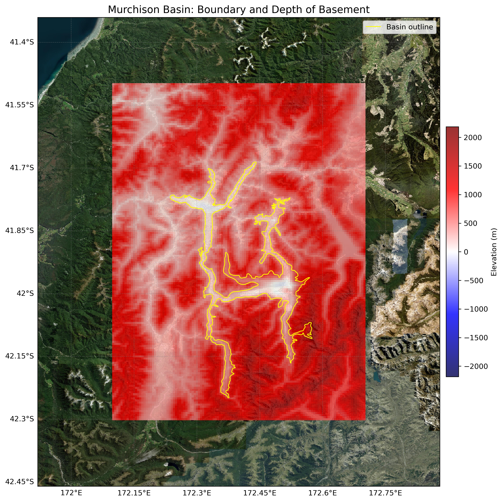

# Basin : Murchison

## Overview
|         |                     |
|---------|---------------------|
| Version | 20p7           |
| Type    | 1        |
| Author  | Tim Tuckey (USER2020)            |
| Created | 2020-07           |

## Images

*Figure 1 Location*

*Figure 2 Murchison Basin Map*

*Figure 3 Murchison Outline*

## Data
### Boundaries
- Murchison_outline_WGS84 : [TXT](../../velocity_modelling/data/regional/Murchison/Murchison_outline_WGS84.txt) / [GeoJSON](../../velocity_modelling/data/regional/Murchison/Murchison_outline_WGS84.geojson)

### Surfaces
- NZ_DEM_HD : [HDF5](../../velocity_modelling/data/global/surface/NZ_DEM_HD.h5) / [TXT](../../velocity_modelling/data/global/surface/NZ_DEM_HD.in) (Submodel: canterbury1d_v2)
- Murchison_basement_WGS84 : [HDF5](../../velocity_modelling/data/regional/Murchison/Murchison_basement_WGS84.h5) / [TXT](../../velocity_modelling/data/regional/Murchison/Murchison_basement_WGS84.in) (Submodel: N/A)

## Data retrieved from
### Boundaries
- [Murchison_Basin_Outline_v1_WGS84.txt](https://github.com/ucgmsim/Velocity-Model/tree/main/Data/USER20_BASINS/Murchison_Basin_Outline_v1_WGS84.txt)

### Surfaces
- [NZ_DEM_HD.in](https://github.com/ucgmsim/Velocity-Model/tree/main/Data/DEM/NZ_DEM_HD.in)
- [MurchisonBasin_WGS84_500m_v2020v07v15.in](https://github.com/ucgmsim/Velocity-Model/tree/main/Data/USER20_BASINS/MurchisonBasin_WGS84_500m_v2020v07v15.in)

---
*Page generated on: June 06, 2025, 15:31 NZST/NZDT*
