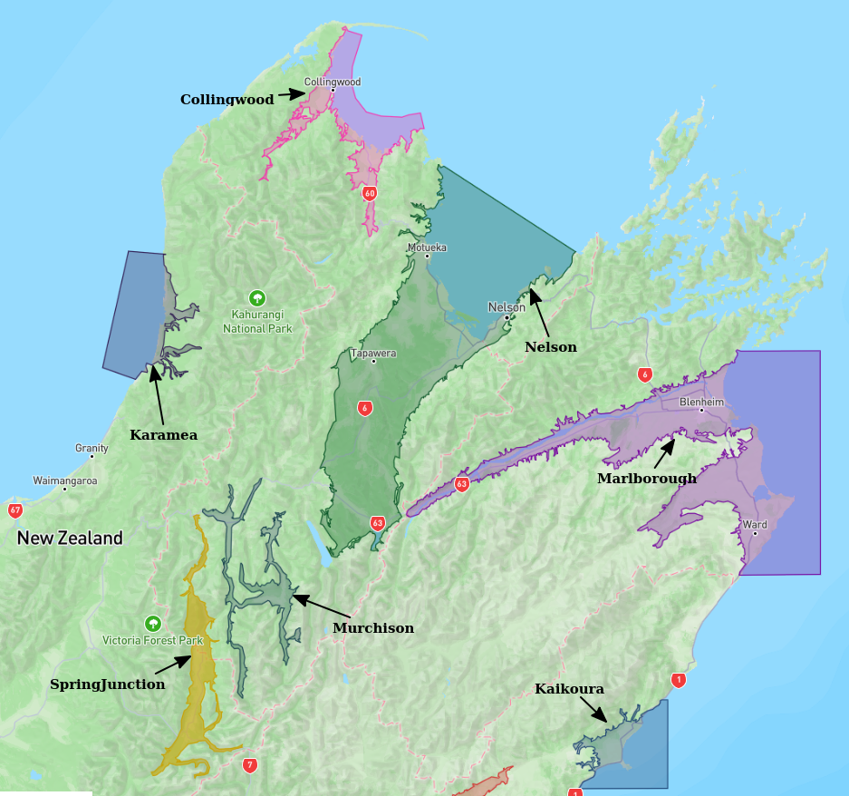
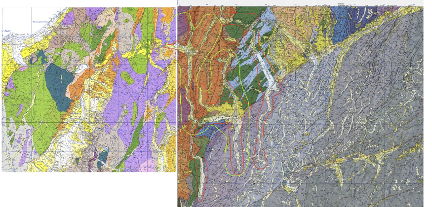

# Basin : Murchison

## Overview
|         |                     |
|---------|---------------------|
| Version | 20p7           |
| Type    | 1        |
| Author  | Tim Tuckey (USER2020)            |
| Created | 2020-07           |

## Images

*Figure 1 Location*

*Figure 2 Murchison Basement*

## Data
### Boundaries
- [Murchison_Basin_Outline_v1_WGS84.txt](../../velocity_modelling/Data/USER20_BASINS/Murchison_Basin_Outline_v1_WGS84.txt)

### Surfaces
- [NZ_DEM](../../velocity_modelling/Data/DEM/NZ_DEM_HD.in) (Submodel: canterbury1d_v2)
- [MurchisonBasement](../../velocity_modelling/Data/USER20_BASINS/MurchisonBasin_WGS84_500m_v2020v07v15.in) (Submodel: N/A)

---
*Page generated on: March 19, 2025, 12:47 NZST/NZDT*
