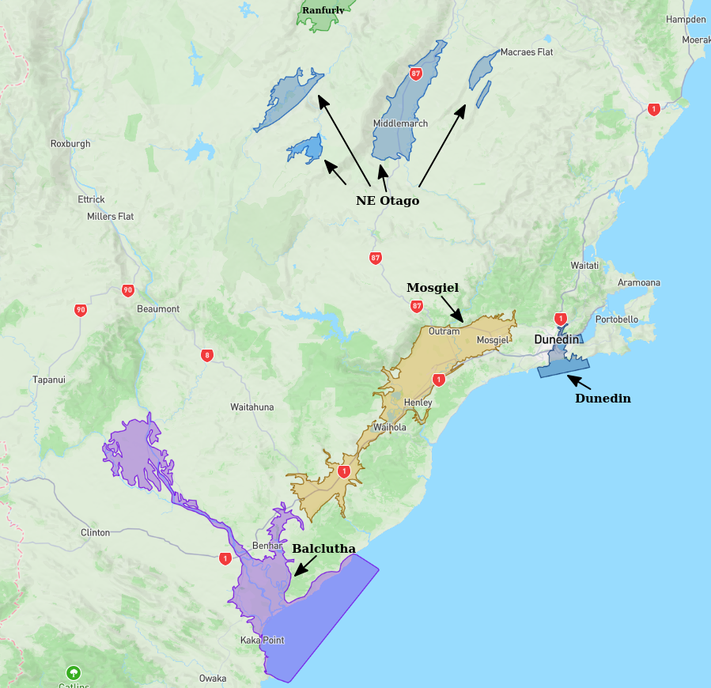
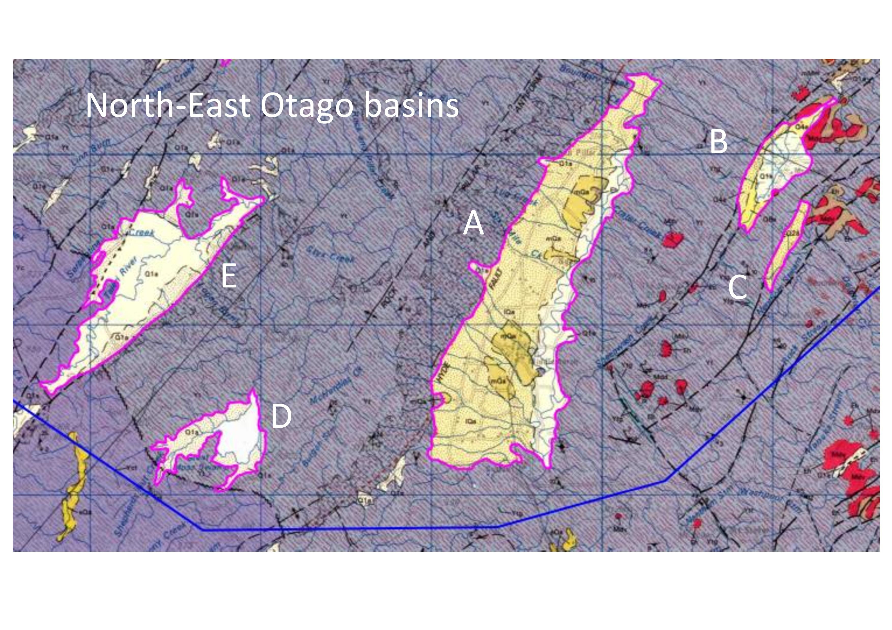

# Basin : NE_Otago

## Overview
|         |                     |
|---------|---------------------|
| Version | 20p7           |
| Type    | 1        |
| Author  | Cameron Douglas (USER2020)            |
| Created | 2020-07           |

## Images

*Figure 1 Location*

*Figure 2 Ne Otago Basin Map*

*Figure 3 Ne Otago Basins Classification-page-001*

## Notes
- Alexandra, Ranfurly and NE_Otago share the same basement

## Data
### Boundaries
- NE_Otago_outline_WGS84_1 : [TXT](../../velocity_modelling/data/regional/NE_Otago/NE_Otago_outline_WGS84_1.txt) / [GeoJSON](../../velocity_modelling/data/regional/NE_Otago/NE_Otago_outline_WGS84_1.geojson)
- NE_Otago_outline_WGS84_2 : [TXT](../../velocity_modelling/data/regional/NE_Otago/NE_Otago_outline_WGS84_2.txt) / [GeoJSON](../../velocity_modelling/data/regional/NE_Otago/NE_Otago_outline_WGS84_2.geojson)
- NE_Otago_outline_WGS84_3 : [TXT](../../velocity_modelling/data/regional/NE_Otago/NE_Otago_outline_WGS84_3.txt) / [GeoJSON](../../velocity_modelling/data/regional/NE_Otago/NE_Otago_outline_WGS84_3.geojson)
- NE_Otago_outline_WGS84_4 : [TXT](../../velocity_modelling/data/regional/NE_Otago/NE_Otago_outline_WGS84_4.txt) / [GeoJSON](../../velocity_modelling/data/regional/NE_Otago/NE_Otago_outline_WGS84_4.geojson)
- NE_Otago_outline_WGS84_5 : [TXT](../../velocity_modelling/data/regional/NE_Otago/NE_Otago_outline_WGS84_5.txt) / [GeoJSON](../../velocity_modelling/data/regional/NE_Otago/NE_Otago_outline_WGS84_5.geojson)

### Surfaces
- NZ_DEM_HD : [HDF5](../../velocity_modelling/data/global/surface/NZ_DEM_HD.h5) / [TXT](../../velocity_modelling/data/global/surface/NZ_DEM_HD.in) (Submodel: canterbury1d_v2)
- NE_Otago_basement_WGS84 : [HDF5](../../velocity_modelling/data/regional/NE_Otago/NE_Otago_basement_WGS84.h5) / [TXT](../../velocity_modelling/data/regional/NE_Otago/NE_Otago_basement_WGS84.in) (Submodel: N/A)

## Data retrieved from
### Boundaries
- [NE_otago_A_outline.txt](https://github.com/ucgmsim/Velocity-Model/tree/main/Data/USER20_BASINS/NE_otago/NE_otago_A_outline.txt)
- [NE_otago_B_outline.txt](https://github.com/ucgmsim/Velocity-Model/tree/main/Data/USER20_BASINS/NE_otago/NE_otago_B_outline.txt)
- [NE_otago_C_outline.txt](https://github.com/ucgmsim/Velocity-Model/tree/main/Data/USER20_BASINS/NE_otago/NE_otago_C_outline.txt)
- [NE_otago_D_outline.txt](https://github.com/ucgmsim/Velocity-Model/tree/main/Data/USER20_BASINS/NE_otago/NE_otago_D_outline.txt)
- [NE_otago_E_outline.txt](https://github.com/ucgmsim/Velocity-Model/tree/main/Data/USER20_BASINS/NE_otago/NE_otago_E_outline.txt)

### Surfaces
- [NZ_DEM_HD.in](https://github.com/ucgmsim/Velocity-Model/tree/main/Data/DEM/NZ_DEM_HD.in)
- [ran-alex_proj_WGS84.in](https://github.com/ucgmsim/Velocity-Model/tree/main/Data/USER20_BASINS/ran-alex_proj_WGS84.in)

---
*Page generated on: June 18, 2025, 17:14 NZST/NZDT*
