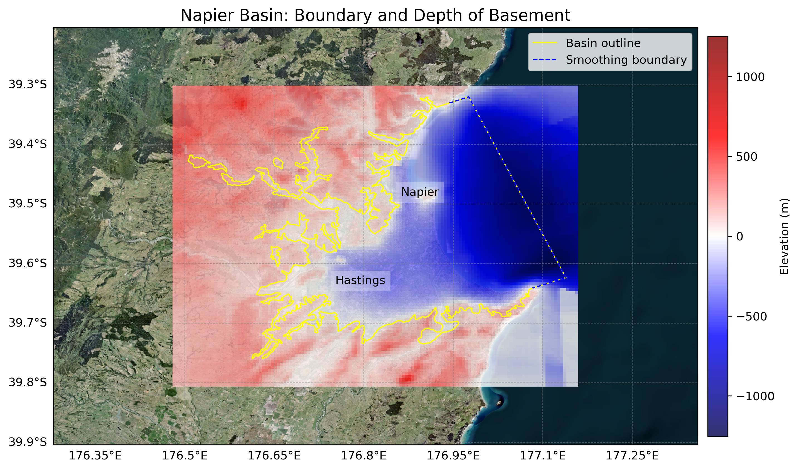

# Basin : Napier

## Overview
|         |                     |
|---------|---------------------|
| Version | 21p7           |
| Type    | 1        |
| Author  | William Lee (USER2021)            |
| Created | 2021-07           |

## Images

*Figure 1 Location*

*Figure 2 Napier Basin Map*

*Figure 3 Napier Outline*

## Data
### Boundaries
- Napier_outline_WGS84_1 : [TXT](../../velocity_modelling/data/regional/Napier/Napier_outline_WGS84_1.txt) / [GeoJSON](../../velocity_modelling/data/regional/Napier/Napier_outline_WGS84_1.geojson)
- Napier_outline_WGS84_2 : [TXT](../../velocity_modelling/data/regional/Napier/Napier_outline_WGS84_2.txt) / [GeoJSON](../../velocity_modelling/data/regional/Napier/Napier_outline_WGS84_2.geojson)
- Napier_outline_WGS84_3 : [TXT](../../velocity_modelling/data/regional/Napier/Napier_outline_WGS84_3.txt) / [GeoJSON](../../velocity_modelling/data/regional/Napier/Napier_outline_WGS84_3.geojson)
- Napier_outline_WGS84_4 : [TXT](../../velocity_modelling/data/regional/Napier/Napier_outline_WGS84_4.txt) / [GeoJSON](../../velocity_modelling/data/regional/Napier/Napier_outline_WGS84_4.geojson)
- Napier_outline_WGS84_5 : [TXT](../../velocity_modelling/data/regional/Napier/Napier_outline_WGS84_5.txt) / [GeoJSON](../../velocity_modelling/data/regional/Napier/Napier_outline_WGS84_5.geojson)
- Napier_outline_WGS84_6 : [TXT](../../velocity_modelling/data/regional/Napier/Napier_outline_WGS84_6.txt) / [GeoJSON](../../velocity_modelling/data/regional/Napier/Napier_outline_WGS84_6.geojson)

### Surfaces
- NZ_DEM_HD : [HDF5](../../velocity_modelling/data/global/surface/NZ_DEM_HD.h5) / [TXT](../../velocity_modelling/data/global/surface/NZ_DEM_HD.in) (Submodel: canterbury1d_v2)
- Napier_basement_WGS84 : [HDF5](../../velocity_modelling/data/regional/Napier/Napier_basement_WGS84.h5) / [TXT](../../velocity_modelling/data/regional/Napier/Napier_basement_WGS84.in) (Submodel: N/A)

### Smoothing Boundaries
- [Napier_smoothing.txt](../../velocity_modelling/data/regional/Napier/Napier_smoothing.txt)

## Data retrieved from
### Boundaries
- [Napier1_Outline_WGS84_delim.dat](https://github.com/ucgmsim/Velocity-Model/tree/main/Data/Basins/Napier_Hawkes_Bay/v21p7/Napier1_Outline_WGS84_delim.dat)
- [Napier2_Outline_WGS84_delim.dat](https://github.com/ucgmsim/Velocity-Model/tree/main/Data/Basins/Napier_Hawkes_Bay/v21p7/Napier2_Outline_WGS84_delim.dat)
- [Napier3_Outline_WGS84_delim.dat](https://github.com/ucgmsim/Velocity-Model/tree/main/Data/Basins/Napier_Hawkes_Bay/v21p7/Napier3_Outline_WGS84_delim.dat)
- [Napier4_Outline_WGS84_delim.dat](https://github.com/ucgmsim/Velocity-Model/tree/main/Data/Basins/Napier_Hawkes_Bay/v21p7/Napier4_Outline_WGS84_delim.dat)
- [Napier5_Outline_WGS84_delim.dat](https://github.com/ucgmsim/Velocity-Model/tree/main/Data/Basins/Napier_Hawkes_Bay/v21p7/Napier5_Outline_WGS84_delim.dat)
- [Napier6_Outline_WGS84_delim.dat](https://github.com/ucgmsim/Velocity-Model/tree/main/Data/Basins/Napier_Hawkes_Bay/v21p7/Napier6_Outline_WGS84_delim.dat)

### Surfaces
- [NZ_DEM_HD.in](https://github.com/ucgmsim/Velocity-Model/tree/main/Data/DEM/NZ_DEM_HD.in)
- [Napier_Grid_WGS84_Export.in](https://github.com/ucgmsim/Velocity-Model/tree/main/Data/Basins/Napier_Hawkes_Bay/v21p7/Napier_Grid_WGS84_Export.in)

---
*Page generated on: June 06, 2025, 15:31 NZST/NZDT*
