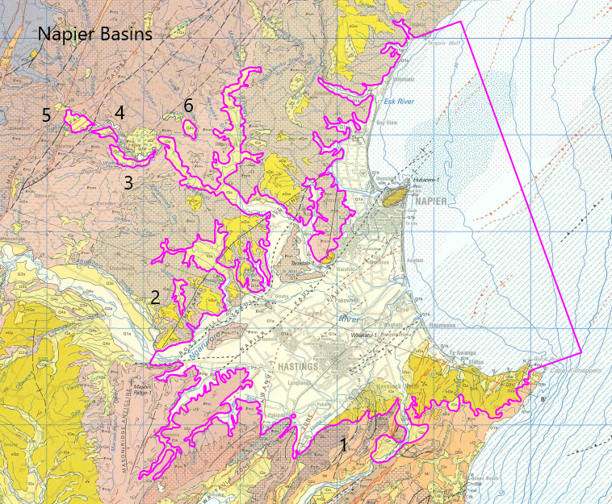

# Basin : Napier

## Overview
|         |                     |
|---------|---------------------|
| Version | 21p7           |
| Type    | 1        |
| Author  | William Lee (USER2021)            |
| Created | 2021-07           |

## Images

*Figure 1 Location*

*Figure 2 Napier Basement*

## Data
### Boundaries
- [Napier1_Outline_WGS84_delim.dat](https://github.com/ucgmsim/Velocity-Model/tree/main/Data/Basins/Napier_Hawkes_Bay/v21p7/Napier1_Outline_WGS84_delim.dat)
- [Napier2_Outline_WGS84_delim.dat](https://github.com/ucgmsim/Velocity-Model/tree/main/Data/Basins/Napier_Hawkes_Bay/v21p7/Napier2_Outline_WGS84_delim.dat)
- [Napier3_Outline_WGS84_delim.dat](https://github.com/ucgmsim/Velocity-Model/tree/main/Data/Basins/Napier_Hawkes_Bay/v21p7/Napier3_Outline_WGS84_delim.dat)
- [Napier4_Outline_WGS84_delim.dat](https://github.com/ucgmsim/Velocity-Model/tree/main/Data/Basins/Napier_Hawkes_Bay/v21p7/Napier4_Outline_WGS84_delim.dat)
- [Napier5_Outline_WGS84_delim.dat](https://github.com/ucgmsim/Velocity-Model/tree/main/Data/Basins/Napier_Hawkes_Bay/v21p7/Napier5_Outline_WGS84_delim.dat)
- [Napier6_Outline_WGS84_delim.dat](https://github.com/ucgmsim/Velocity-Model/tree/main/Data/Basins/Napier_Hawkes_Bay/v21p7/Napier6_Outline_WGS84_delim.dat)

### Surfaces
- [NZ_DEM](https://github.com/ucgmsim/Velocity-Model/tree/main/Data/DEM/NZ_DEM_HD.in) (Submodel: canterbury1d_v2)
- [Napier](https://github.com/ucgmsim/Velocity-Model/tree/main/Data/Path not found) (Submodel: N/A)

### Smoothing Boundaries
- [Napier1_v21p7.txt](https://github.com/ucgmsim/Velocity-Model/tree/main/Data/Boundaries/Smoothing/Napier1_v21p7.txt)

---
*Page generated on: March 19, 2025, 14:20 NZST/NZDT*
