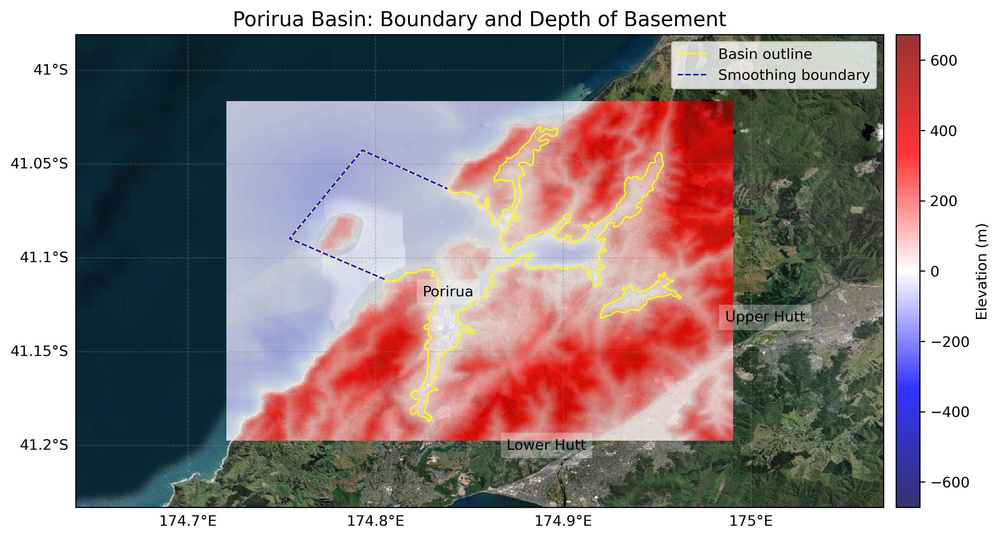
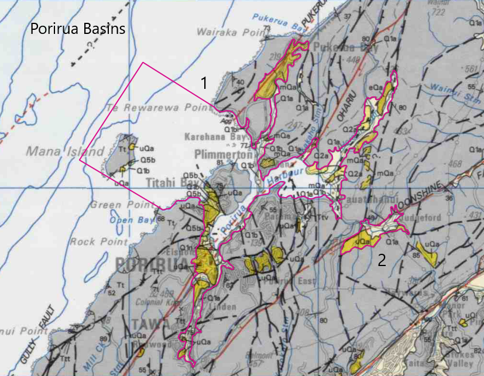

# Basin : Porirua

## Overview
|         |                     |
|---------|---------------------|
| Version | 21p7           |
| Type    | 1        |
| Author  | William Lee (USER2021)            |
| Created | 2021-07           |

## Images

*Figure 1 Location*

*Figure 2 Porirua Basin Map*

*Figure 3 Porirua Outline*

## Data
### Boundaries
- Porirua_outline_WGS84_1 : [TXT](../../velocity_modelling/data/regional/Porirua/Porirua_outline_WGS84_1.txt) / [GeoJSON](../../velocity_modelling/data/regional/Porirua/Porirua_outline_WGS84_1.geojson)
- Porirua_outline_WGS84_2 : [TXT](../../velocity_modelling/data/regional/Porirua/Porirua_outline_WGS84_2.txt) / [GeoJSON](../../velocity_modelling/data/regional/Porirua/Porirua_outline_WGS84_2.geojson)

### Surfaces
- NZ_DEM_HD : [HDF5](../../velocity_modelling/data/global/surface/NZ_DEM_HD.h5) / [TXT](../../velocity_modelling/data/global/surface/NZ_DEM_HD.in) (Submodel: canterbury1d_v2)
- Porirua_basement_WGS84 : [HDF5](../../velocity_modelling/data/regional/Porirua/Porirua_basement_WGS84.h5) / [TXT](../../velocity_modelling/data/regional/Porirua/Porirua_basement_WGS84.in) (Submodel: N/A)

### Smoothing Boundaries
- [Porirua_smoothing.txt](../../velocity_modelling/data/regional/Porirua/Porirua_smoothing.txt)

## Data retrieved from
### Boundaries
- [Porirua1_Outline_WGS84.dat](https://github.com/ucgmsim/Velocity-Model/tree/main/Data/Basins/Greater_Wellington_and_Porirua/v21p7/Porirua1_Outline_WGS84.dat)
- [Porirua2_Outline_WGS84.dat](https://github.com/ucgmsim/Velocity-Model/tree/main/Data/Basins/Greater_Wellington_and_Porirua/v21p7/Porirua2_Outline_WGS84.dat)

### Surfaces
- [NZ_DEM_HD.in](https://github.com/ucgmsim/Velocity-Model/tree/main/Data/DEM/NZ_DEM_HD.in)
- [Porirua_Elevation_WGS84.in](https://github.com/ucgmsim/Velocity-Model/tree/main/Data/Basins/Greater_Wellington_and_Porirua/v21p7/Porirua_Elevation_WGS84.in)

---
*Page generated on: June 18, 2025, 17:14 NZST/NZDT*
