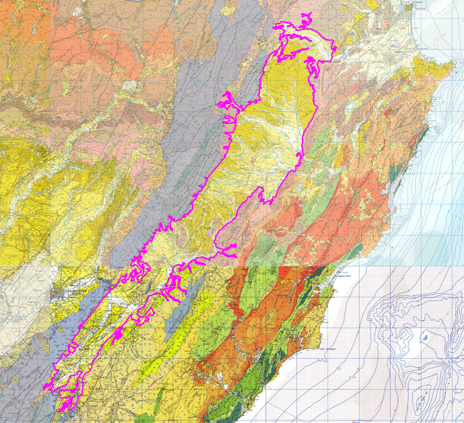

# Basin : SouthernHawkesBay

## Overview
|         |                     |
|---------|---------------------|
| Version | 21p12           |
| Type    | 1        |
| Author  | William Lee (USER2021)            |
| Created | 2021-12           |

## Images
 Location
 SouthernHawkesBay Basement

## Notes
- (Comment from the author) "Will be near the Wairarapa and Manawatu-Whanganui / Taranaki basins, but does not physically touch due to rock."
- (Comment from the author) "Physically connects to Northern Hawkes Bay in the Ngaruroro River valley. Need to check consistency in the bedrock surfaces at the intersection."
- Missing some parts in the east coast.

## Data
### Boundaries
- [SHB_Outline_WGS84_delim.dat](../../velocity_modelling/Data/Basins/Southern_Hawkes_Bay/v21p12/SHB_Outline_WGS84_delim.dat)

### Surfaces
- [NZ_DEM](../../velocity_modelling/Data/DEM/NZ_DEM_HD.in) (Submodel: canterbury1d_v2)
- [SouthernHawkesBay](../../velocity_modelling/Data/Path not found) (Submodel: N/A)

---
*Page generated on: March 19, 2025, 12:34 NZST/NZDT*
