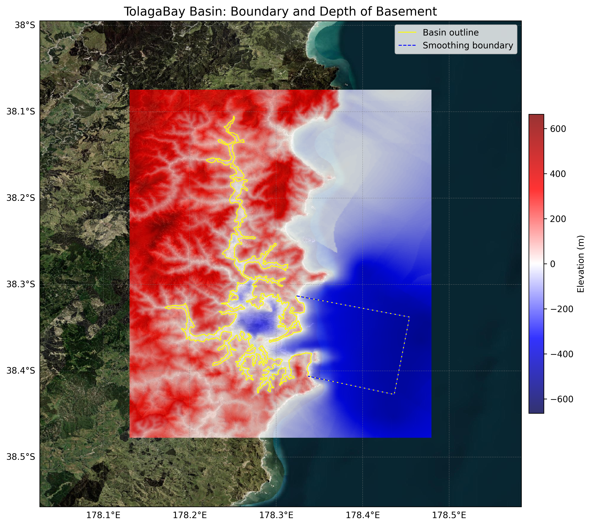
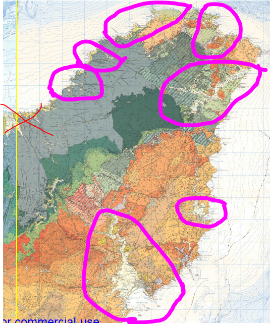

# Basin : TolagaBay

## Overview
|         |                     |
|---------|---------------------|
| Version | 25p5           |
| Type    | 1        |
| Author  | Cameron Davis / Emma Coumbe (USER2022)            |
| Created | 2025-05           |

## Images

*Figure 1 Location*

*Figure 2 Eastcape Coastal River Valleys*

## Data
### Boundaries
- TolagaBay_outline_WGS84 : [TXT](../../velocity_modelling/data/regional/TolagaBay/TolagaBay_outline_WGS84.txt) / [GeoJSON](../../velocity_modelling/data/regional/TolagaBay/TolagaBay_outline_WGS84.geojson)

### Surfaces
- NZ_DEM_HD : [HDF5](../../velocity_modelling/data/global/surface/NZ_DEM_HD.h5) / [TXT](../../velocity_modelling/data/global/surface/NZ_DEM_HD.in) (Submodel: canterbury1d_v2)
- TolagaBay_basement_WGS84 : [HDF5](../../velocity_modelling/data/regional/TolagaBay/TolagaBay_basement_WGS84.h5) / [TXT](../../velocity_modelling/data/regional/TolagaBay/TolagaBay_basement_WGS84.in) (Submodel: N/A)

### Smoothing Boundaries
- [TolagaBay_smoothing.txt](../../velocity_modelling/data/regional/TolagaBay/TolagaBay_smoothing.txt)

---
*Page generated on: June 18, 2025, 17:14 NZST/NZDT*
