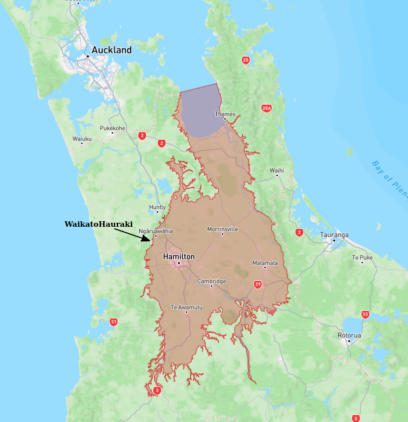

# Basin : WaikatoHauraki

## Overview
|         |                     |
|---------|---------------------|
| Version | 19p7           |
| Type    | 1        |
| Author  | Andrew Stolte            |
| Created | 2019-07           |

## Images

*Figure 1 Location*

*Figure 2 WaikatoHauraki Basement*

## Data
### Boundaries
- [WaikatoHaurakiBasinEdge_WGS84.txt](https://github.com/ucgmsim/Velocity-Model/tree/main/Data/Boundaries/WaikatoHaurakiBasinEdge_WGS84.txt)

### Surfaces
- [NZ_DEM](https://github.com/ucgmsim/Velocity-Model/tree/main/Data/DEM/NZ_DEM_HD.in) (Submodel: canterbury1d_v2)
- [WaikatoHaurakiBasement](https://github.com/ucgmsim/Velocity-Model/tree/main/Data/NI_BASINS/WaikatoHaurakiBasin_WGS84_500m_v2019v07v05.in) (Submodel: N/A)

### Smoothing Boundaries
- [WaikatoHauraki_v19p7.txt](https://github.com/ucgmsim/Velocity-Model/tree/main/Data/Boundaries/Smoothing/WaikatoHauraki_v19p7.txt)

---
*Page generated on: March 19, 2025, 14:20 NZST/NZDT*
