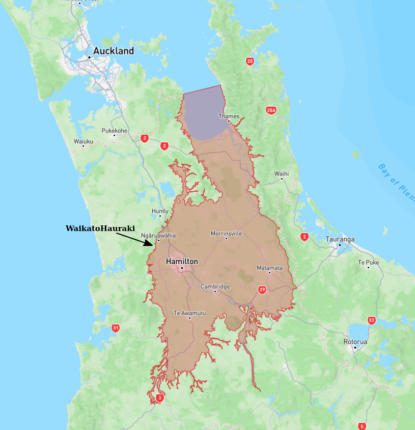
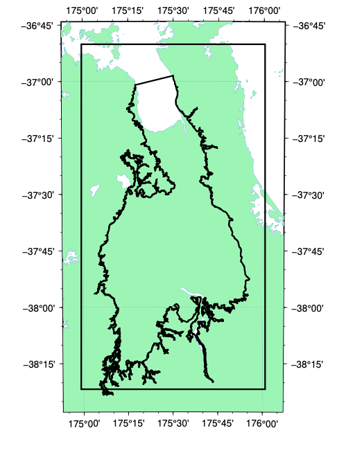

# Basin : WaikatoHauraki

## Overview
|         |                     |
|---------|---------------------|
| Version | 19p7           |
| Type    | 1        |
| Author  | Andrew Stolte            |
| Created | 2019-07           |

## Images

*Figure 1 Location*

*Figure 2 Waikatohauraki Basin Map*

*Figure 3 Waikato Hauraki Outline*

## Data
### Boundaries
- WaikatoHauraki_outline_WGS84 : [TXT](../../velocity_modelling/data/regional/WaikatoHauraki/WaikatoHauraki_outline_WGS84.txt) / [GeoJSON](../../velocity_modelling/data/regional/WaikatoHauraki/WaikatoHauraki_outline_WGS84.geojson)

### Surfaces
- NZ_DEM_HD : [HDF5](../../velocity_modelling/data/global/surface/NZ_DEM_HD.h5) / [TXT](../../velocity_modelling/data/global/surface/NZ_DEM_HD.in) (Submodel: canterbury1d_v2)
- WaikatoHauraki_basement_WGS84 : [HDF5](../../velocity_modelling/data/regional/WaikatoHauraki/WaikatoHauraki_basement_WGS84.h5) / [TXT](../../velocity_modelling/data/regional/WaikatoHauraki/WaikatoHauraki_basement_WGS84.in) (Submodel: N/A)

### Smoothing Boundaries
- [WaikatoHauraki_smoothing.txt](../../velocity_modelling/data/regional/WaikatoHauraki/WaikatoHauraki_smoothing.txt)

## Data retrieved from
### Boundaries
- [WaikatoHaurakiBasinEdge_WGS84.txt](https://github.com/ucgmsim/Velocity-Model/tree/main/Data/Boundaries/WaikatoHaurakiBasinEdge_WGS84.txt)

### Surfaces
- [NZ_DEM_HD.in](https://github.com/ucgmsim/Velocity-Model/tree/main/Data/DEM/NZ_DEM_HD.in)
- [WaikatoHaurakiBasin_WGS84_500m_v2019v07v05.in](https://github.com/ucgmsim/Velocity-Model/tree/main/Data/NI_BASINS/WaikatoHaurakiBasin_WGS84_500m_v2019v07v05.in)

---
*Page generated on: June 18, 2025, 17:14 NZST/NZDT*
