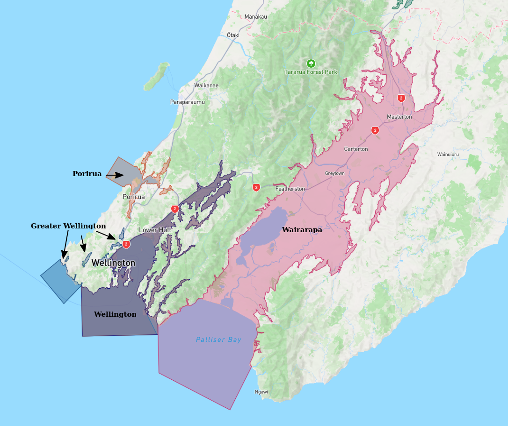

# Basin : Wairarapa

## Overview
|         |                     |
|---------|---------------------|
| Version | 21p12           |
| Type    | 1        |
| Author  | William Lee (USER2021)            |
| Created | 2021-12           |

## Images

*Figure 1 Image 1*

## Notes
- (Comment from the author) "Consider adding east coastal basins (e.g. Uruti Point)"

## Data
### Boundaries
- [Wairarapa_Outline_WGS84_delim.dat](../../velocity_modelling/Data/Basins/Wairarapa/v21p12/Wairarapa_Outline_WGS84_delim.dat)

### Surfaces
- [NZ_DEM](../../velocity_modelling/Data/DEM/NZ_DEM_HD.in) (Submodel: canterbury1d_v2)
- [WairarapaBasement](../../velocity_modelling/Data/Basins/Wairarapa/v21p12/Wairarapa_Surface_Export.in) (Submodel: N/A)

### Smoothing Boundaries
- [Wairarapa_v21p12.txt](../../velocity_modelling/Data/Boundaries/Smoothing/Wairarapa_v21p12.txt)

---
*Page generated on: March 19, 2025, 12:54 NZST/NZDT*
