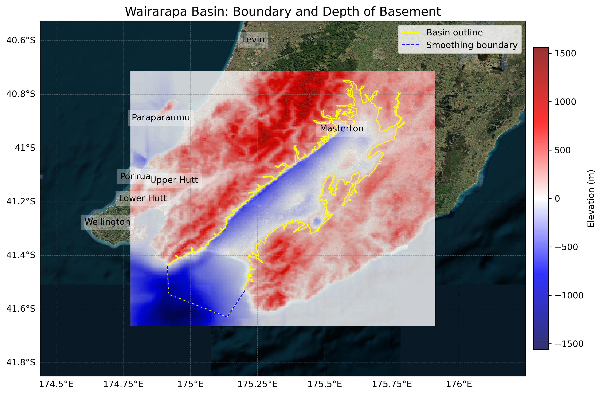

# Basin : Wairarapa

## Overview
|         |                     |
|---------|---------------------|
| Version | 21p12           |
| Type    | 1        |
| Author  | William Lee (USER2021)            |
| Created | 2021-12           |

## Images

*Figure 1 Location*

*Figure 2 Wairarapa Basin Map*

## Notes
- (Comment from the author) "Consider adding east coastal basins (e.g. Uruti Point)"

## Data
### Boundaries
- Wairarapa_outline_WGS84 : [TXT](../../velocity_modelling/data/regional/Wairarapa/Wairarapa_outline_WGS84.txt) / [GeoJSON](../../velocity_modelling/data/regional/Wairarapa/Wairarapa_outline_WGS84.geojson)

### Surfaces
- NZ_DEM_HD : [HDF5](../../velocity_modelling/data/global/surface/NZ_DEM_HD.h5) / [TXT](../../velocity_modelling/data/global/surface/NZ_DEM_HD.in) (Submodel: canterbury1d_v2)
- Wairarapa_basement_WGS84 : [HDF5](../../velocity_modelling/data/regional/Wairarapa/Wairarapa_basement_WGS84.h5) / [TXT](../../velocity_modelling/data/regional/Wairarapa/Wairarapa_basement_WGS84.in) (Submodel: N/A)

### Smoothing Boundaries
- [Wairarapa_smoothing.txt](../../velocity_modelling/data/regional/Wairarapa/Wairarapa_smoothing.txt)

## Data retrieved from
### Boundaries
- [Wairarapa_Outline_WGS84_delim.dat](https://github.com/ucgmsim/Velocity-Model/tree/main/Data/Basins/Wairarapa/v21p12/Wairarapa_Outline_WGS84_delim.dat)

### Surfaces
- [NZ_DEM_HD.in](https://github.com/ucgmsim/Velocity-Model/tree/main/Data/DEM/NZ_DEM_HD.in)
- [Wairarapa_Surface_Export.in](https://github.com/ucgmsim/Velocity-Model/tree/main/Data/Basins/Wairarapa/v21p12/Wairarapa_Surface_Export.in)

---
*Page generated on: March 28, 2025, 16:34 NZST/NZDT*
