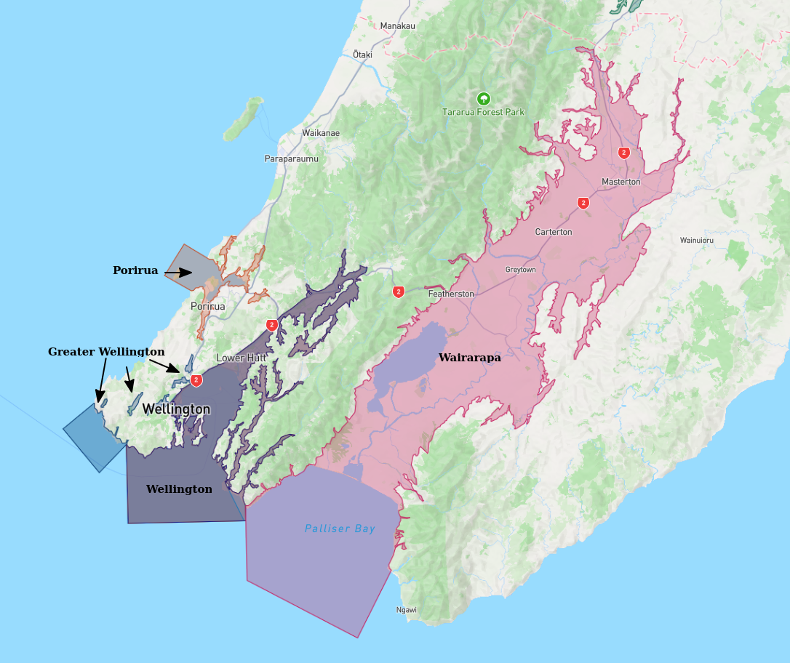
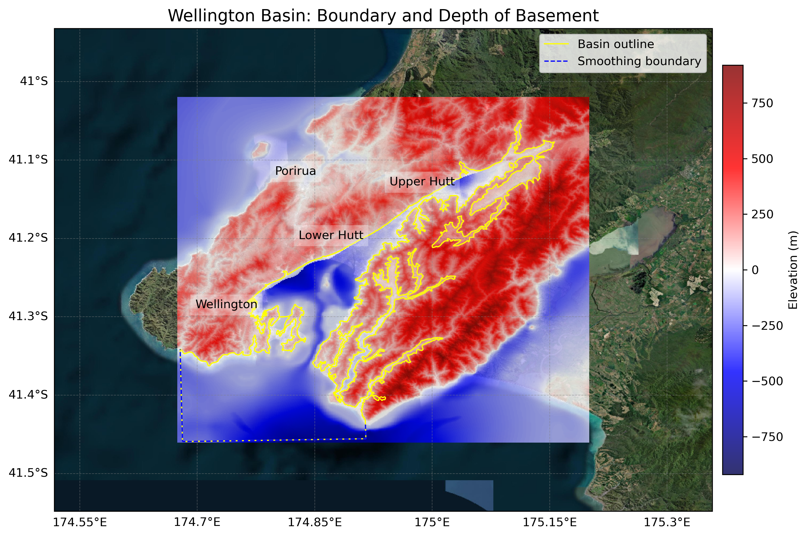

# Basin : Wellington

## Overview
|         |                     |
|---------|---------------------|
| Version | 25p5           |
| Type    | 3        |
| Author  | Robin Lee / Matt Hill            |
| Created | 2025-05           |
| Older Versions | 19p1, 19p6, 21p8 |

## Images

*Figure 1 Location*

*Figure 2 Wellington Basin Map*

*Figure 3 Wellington Outline*

## Notes
- 19.1,19.6 Robin Lee (basement update)
- 21.8 Matt Hill (basement update)
- 25.5 Matt Hill (city extent model combined with regional model)

## Data
### Boundaries
- Wellington_outline_WGS84 : [TXT](../../velocity_modelling/data/regional/Wellington/Wellington_outline_WGS84.txt) / [GeoJSON](../../velocity_modelling/data/regional/Wellington/Wellington_outline_WGS84.geojson)

### Surfaces
- NZ_DEM_HD : [HDF5](../../velocity_modelling/data/global/surface/NZ_DEM_HD.h5) / [TXT](../../velocity_modelling/data/global/surface/NZ_DEM_HD.in) (Submodel: canterbury1d_v2)
- Wellington_basement_WGS84_v25p5 :  (Submodel: N/A)

### Smoothing Boundaries
- [Wellington_smoothing.txt](../../velocity_modelling/data/regional/Wellington/Wellington_smoothing.txt)

---
*Page generated on: June 18, 2025, 17:14 NZST/NZDT*
