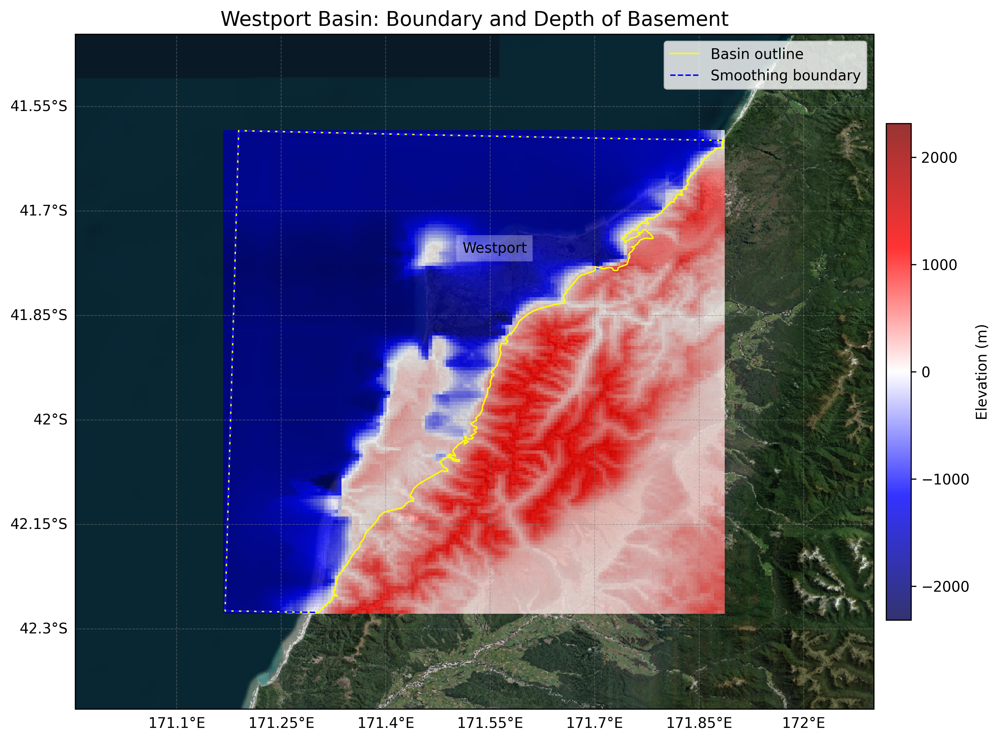

# Basin : Westport

## Overview
|         |                     |
|---------|---------------------|
| Version | 24p9           |
| Type    | N/A        |
| Author  | Kaleb Finn / Ayushi Tiwari (ENCN493)            |
| Created | 2024-09           |

## Images

*Figure 1 Location*

## Data
### Boundaries
- [Westport_outline_WGS84.txt](../../velocity_modelling/data/regional/Westport/Westport_outline_WGS84.txt)

### Surfaces
- [NZ_DEM_HD.in](../../velocity_modelling/data/global/surface/NZ_DEM_HD.in) (Submodel: canterbury1d_v2)
- [Westport_basement_WGS84.in](../../velocity_modelling/data/regional/Westport/Westport_basement_WGS84.in) (Submodel: N/A)

### Smoothing Boundaries
- [Westport_smoothing.txt](../../velocity_modelling/data/regional/Westport/Westport_smoothing.txt)

---
*Page generated on: March 22, 2025, 19:41 NZST/NZDT*
