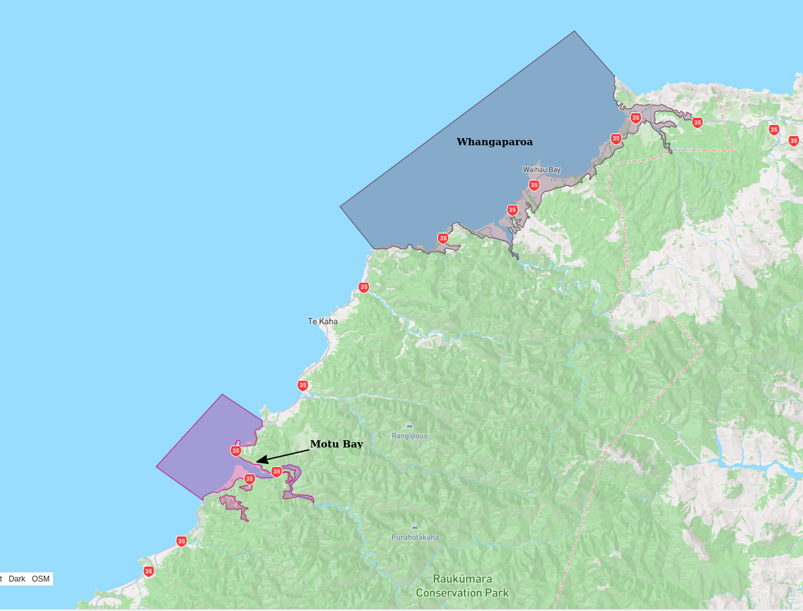
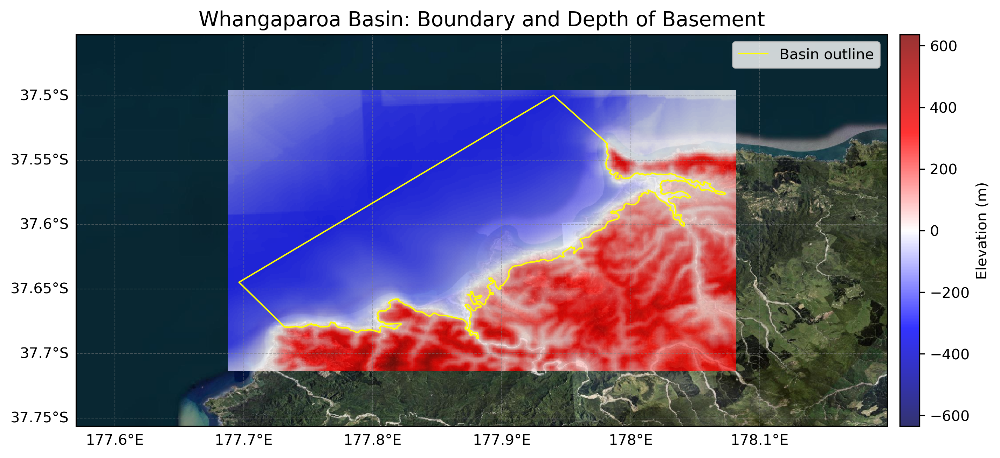

# Basin : Whangaparoa

## Overview
|         |                     |
|---------|---------------------|
| Version | 23p4           |
| Type    | 1        |
| Author  | Cameron Davis / Emma Coumbe (USER2022)            |
| Created | 2023-04           |

## Images

*Figure 1 Location*

*Figure 2 Whangaparoa Basin Map*

## Notes
- See [OmaioBay](OmaioBay.md) for additional notes

## Data
### Boundaries
- Whangaparoa_outline_WGS84 : [TXT](../../velocity_modelling/data/regional/Whangaparoa/Whangaparoa_outline_WGS84.txt) / [GeoJSON](../../velocity_modelling/data/regional/Whangaparoa/Whangaparoa_outline_WGS84.geojson)

### Surfaces
- NZ_DEM_HD : [HDF5](../../velocity_modelling/data/global/surface/NZ_DEM_HD.h5) / [TXT](../../velocity_modelling/data/global/surface/NZ_DEM_HD.in) (Submodel: canterbury1d_v2)
- Whangaparoa_basement_WGS84 : [HDF5](../../velocity_modelling/data/regional/Whangaparoa/Whangaparoa_basement_WGS84.h5) / [TXT](../../velocity_modelling/data/regional/Whangaparoa/Whangaparoa_basement_WGS84.in) (Submodel: N/A)

### Smoothing Boundaries
- [Whangaparoa_smoothing.txt](../../velocity_modelling/data/regional/Whangaparoa/Whangaparoa_smoothing.txt)

## Data retrieved from
### Boundaries
- [Whangaparoa_outline_WGS84.txt](https://github.com/ucgmsim/Velocity-Model/tree/main/Data/USER20_BASINS/Whangaparoa_outline_WGS84.txt)

### Surfaces
- [NZ_DEM_HD.in](https://github.com/ucgmsim/Velocity-Model/tree/main/Data/DEM/NZ_DEM_HD.in)
- [Whangaparoa_surface_WGS84.txt](https://github.com/ucgmsim/Velocity-Model/tree/main/Data/USER20_BASINS/Whangaparoa_surface_WGS84.txt)

---
*Page generated on: June 18, 2025, 17:14 NZST/NZDT*
